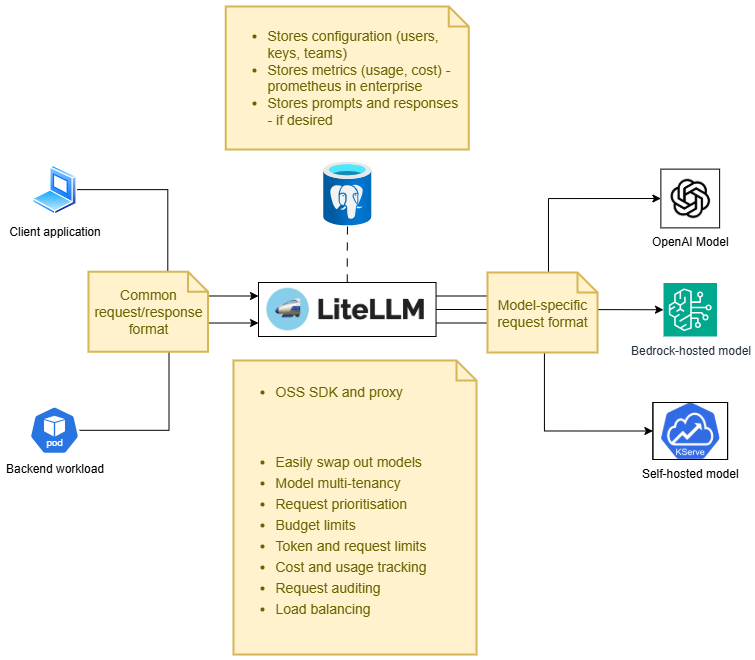

# Architecture

## What LiteLLM is

The following diagram indicates the general architecture of LiteLLM
acting as a proxy:



## What the operator owns

The following diagram indicates the architecture and responsibilities
of the operator, as defined in the scope:


## Two reconciliation pipelines

```
┌──────────────┐ reconcile ┌──────────────────┐  HTTP   ┌──────────────┐
│ Explicit CRs │──────────▶│  Pipeline A      │────────▶│ LiteLLM API  │
│ (Model, Team,│           │  controllers     │         │ (in-cluster) │
│  MCPServer,  │           │ (per-kind        │         └──────────────┘
│  A2AAgent,   │           │  reconciler)     │
│  GuardRail)  │           └──────────────────┘
└──────────────┘
       ▲
       │ owns (SSA + ownerRef)
       │
┌──────┴─────────┐ reconcile ┌──────────────────┐
│ Discovery CRs  │──────────▶│  Pipeline B      │
│ (ModelDisc.,   │           │  upstream-list   │
│  MCPSrvDisc.)  │           │  → child CR      │
└────────────────┘           │  fan-out         │
                             └──────────────────┘
```

- **Pipeline A** reconciles each explicit CR into LiteLLM via REST.
  Wholesale-replace semantics on update; vanish-detect + create-missing
  on safety re-list.
- **Pipeline B** queries upstream provider APIs (anthropic, bedrock,
  gemini, openai, kubeai) or ToolHive, and emits child CRs that
  Pipeline A then reconciles. Discovery never calls LiteLLM directly.

## Per-kind reconciler shape

Every controller in `internal/controller/<kind>_controller.go`
follows the same shape:

1. `Reconcile(ctx, req) (Result, error)` fetches the CR; bails early
   on `IsNotFound`.
2. Resolves dependencies — `LiteLLMConnection/default` cache snapshot,
   `spec.secrets[]` resolution, `{{NAME}}` substitution.
3. Constructs the LiteLLM request body via `internal/litellm/
   <kind>_request.go` (pure data, no side effects).
4. SHA-256 hash over the rendered post-substitution body
   (RFC 8785 canonical JSON).
5. Vanish probe — existence check against LiteLLM (see "List cache"
   below).
6. If hash unchanged AND row exists → no-op (steady state).
   If hash changed → `PUT /...` (drift correction).
   If row vanished → `POST /...` + re-pin status ID.
7. Status update via `meta.SetStatusCondition` (`Ready`,
   `LiteLLMUnavailable`, `LiteLLMRejected`, `SecretNotFound`,
   `UnresolvedPlaceholder`, …).
8. Requeue at `safetyRelistInterval` (default 10m; configurable per
   process — see "Safety re-list" below).

The split between `internal/controller/` (k8s reconcile loop) and
`internal/litellm/` (HTTP surface) is load-bearing: the request
constructors are pure functions and unit-testable without envtest.

## LiteLLM HTTP client

`internal/litellm/client.go`:

- HTTP client with master-key Bearer auth and per-Connection scoped
  cache instance.
- `ClientOption` knobs: `WithTimeout`, `WithListCacheTTL`,
  `WithUserAgent`.
- Domain methods per CRD: `CreateMCPServer`, `UpdateMCPServer`,
  `DeleteMCPServer`, … and the cache-aware
  `CachedListMCPServers(ctx)`, `CachedListAgents(ctx)`.

## List cache (vanish-probe coalescing)

`internal/litellm/list_cache.go`. Single-flight cache keyed per
endpoint (MCP servers, A2A agents).

- TTL default: `DefaultListCacheTTL = 30 * time.Second`.
- Concurrent calls coalesce on an `inflight chan struct{}` — one HTTP
  fetch serves N waiters.
- Invalidated on every successful `Create*` / `Update*` / `Delete*`
  via `invalidateMCPCache()` / `invalidateAgentsCache()`.
- Used by the vanish-probe path in `mcpserver_controller.go` and
  `a2aagent_controller.go` so 20 sibling CRs re-listing the same
  endpoint produce 1 HTTP request per TTL window instead of 20.

Trade-off: vanish detection is delayed by up to TTL seconds when
out-of-band DELETEs land in LiteLLM. Detection still happens within
the next safety re-list interval; the cache only batches probes.

## Vanish probe (shared helper)

`internal/controller/vanish_probe.go` exposes
`probeVanishedResourceID(ctx, lookup, observedID) (verdict, err)`:

- `verdict=keep` — row exists with the observed ID (hash short-
  circuit safe).
- `verdict=clear` — row missing / drifted / 401 / `ErrNotFound`;
  reconciler clears the pinned ID, falls through to CREATE.

Used by MCPServer, Team, A2AAgent, Model. Closure-based — each caller
supplies its own `lookup(id) (found bool, err error)`.

## Safety re-list

`internal/controller/safety_relist.go`:

- Each Pipeline A controller requeues at
  `<kind>SafetyRelistInterval` after a successful reconcile.
- Vars (not consts) — overridable at process start by
  `SetSafetyRelistIntervals(d)`.
- `EnvSafetyRelistInterval = "LITELLM_OPERATOR_SAFETY_RELIST_INTERVAL"`
  → parsed at startup, validated against `SafetyRelistFloor = 5s`.
- Helm: first-class `safetyRelistInterval` value on the operator chart
  (`deploy/helm/alitellm-operator/values.yaml`).

Default 10m balances responsiveness against outbound HTTP rate
(~27/min steady state for the dogfood cluster).

## Pipeline B: SSA-applied child CRs

ModelDiscovery and MCPServerDiscovery use Server-Side Apply with
`fieldManager=alitellm-operator-<kind>discovery` to author child CRs.
Children carry:

- `ownerReferences[controller=true, blockOwnerDeletion=true]` →
  Discovery is the owner; deletion cascades.
- `labels[litellm.ackstorm.ai/generated-by=<discovery-name>]` → the
  controller selects owned children via this label, not via the
  `status.generatedChildren[]` echo.

Discovery itself never calls LiteLLM. Finalizer waits for owned
children to drain; each child's Pipeline A finalizer issues the
LiteLLM DELETE.

## Operator restart → drift reconciliation

Informers resync on startup; every CR re-enters the workqueue. The
hash short-circuit lets steady-state reconciles return after a single
cache read. Vanish probes catch any rows that disappeared from
LiteLLM while the operator was down.

## Where to read next

- Controller-runtime patterns: `internal/controller/doc.go` +
  per-controller godoc.
- LiteLLM HTTP surface: `internal/litellm/*.go`.
- Reconciler scaffolding shared across kinds:
  `bootsweep.go`, `connection_fanin.go`, `predicates.go`,
  `safety_relist.go`, `status_log.go`.
- Development loop: [Development](development.md).
- Release pipeline: [Release Process](release-process.md).
