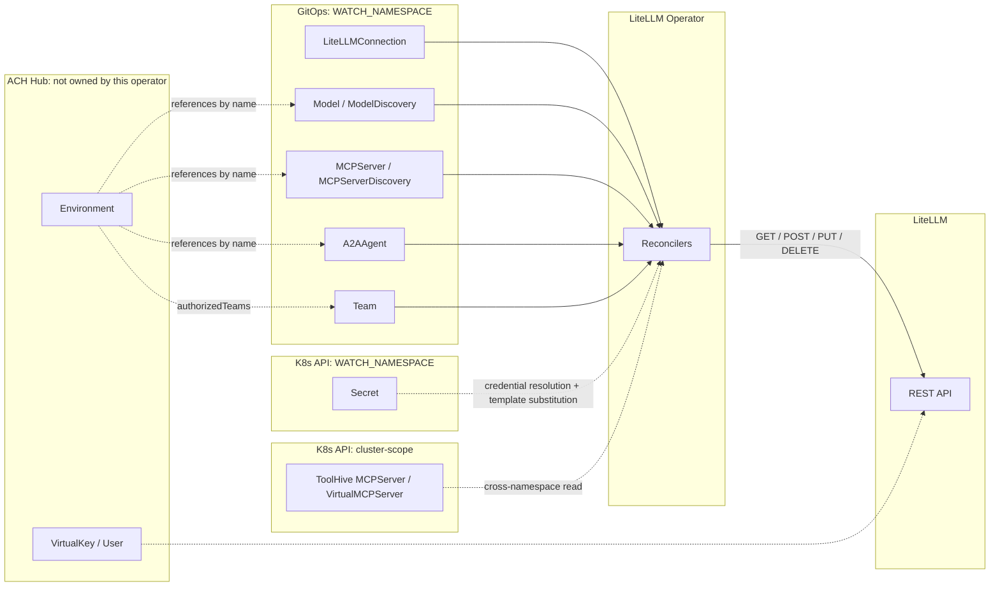

# LiteLLM Operator

**Technical Specification**
**API Group:** `litellm.ackstorm.ai/v1alpha1`
**Document Version:** `v20260515_FINALv3`
**Status:** Final
**Supersedes:** `v20260513_FINALv2`

**Changes from `_FINALv2`:**

- **Discovery kinds emit Kubernetes child CRs, not LiteLLM writes.** `ModelDiscovery` now reconciles into `Model` CRs and `MCPServerDiscovery` into `MCPServer` CRs. The child kinds remain the sole writers of LiteLLM (§3.3 two-pipeline model). Generated children carry `metadata.ownerReferences[controller=true, blockOwnerDeletion=true]` pointing at the parent Discovery, plus `labels[litellm.ackstorm.ai/generated-by]` for selector convenience. Kubernetes garbage collection cascades child deletion when the Discovery is deleted; each child's own finalizer issues the LiteLLM DELETE. **The `_FINALv2` partial-failure orphan caveat in §7.5 is retired** — etcd is now the durable ledger and status-write failures cannot leak LiteLLM entries.
- **Conflict resolution becomes K8s-native.** `Model` ↔ `ModelDiscovery` collisions are enforced by Kubernetes' name-uniqueness guarantee; Discovery's CREATE returns `AlreadyExists` and the candidate is skipped with `reason=ExplicitModelExists`. The render-time skip table for explicit-vs-Discovery in `_FINALv2` is gone.
- **Adoption is "strip the controller ownerRef."** `kubectl patch <kind> <name> --type=json -p='[{"op":"remove","path":"/metadata/ownerReferences"}]'`. Discovery's next refresh skips the adopted child with `ExplicitModelExists` and stops managing it.
- **`Model` flattened.** `spec.type: litellm` removed; `spec.litellm.params` moved to `spec.params`. The API group `litellm.ackstorm.ai/v1alpha1` is the backend selector.
- **`A2AAgent` flattened.** `spec.type: litellm-a2a` removed; `spec.litellm.endpoint` → `spec.endpoint`; `spec.litellm.agentCard` → `spec.agentCard`; `spec.litellm.params` → `spec.params`.
- **`ModelDiscovery` flattened.** Provider sub-blocks removed; fields hoisted to root: `spec.credentialsSecretRef`, `spec.region` (bedrock), `spec.baseUrl` (kubeai / openai). The `spec.type` discriminator drives per-`type` field requirements/forbids in CEL (§4.1).
- **New `spec.info` pass-through bag on `Model` and `ModelDiscovery`.** Maps to LiteLLM's `model_info` top-level body field, sibling of `litellm_params`. The operator's only typed-field overlay on `spec.info` is `model_info.id` (`null` on create, resolved remote id on update). Use for `max_input_tokens` / `max_output_tokens` / capability flags on models outside LiteLLM's built-in registry.
- **Discovery propagates `spec.secrets[]` verbatim to children; it does NOT substitute itself.** Substitution timing moves from "once per Discovery reconcile, applied to every candidate" to "once per child reconcile, against the child's own Secret watch." Rotation now propagates via per-child watches. New AC-SEC4-PROPAGATE.
- **Status field renames** on both Discovery kinds: `registeredNames[]` → `generatedChildren[]`; `registeredCount` → `generatedCount`; `skippedRegistrations[]` → `skippedCandidates[]`; `failedRegistrations[]` → `failedCandidates[]`. New `failedCandidates[].reason=ChildCRWriteFailed`. `LiteLLMRejected` and `LiteLLMUnavailable` are no longer Discovery-level reasons — those failures surface on the generated child CRs.
- **Discovery is no longer gated on `LiteLLMConnection`.** Discovery writes only K8s child CRs, so it proceeds regardless of LiteLLM reachability. The §6.0 propagation rule narrows to the four child kinds (`Model`, `MCPServer`, `A2AAgent`, `Team`).
- **New ACs:** AC-M-INFO1, AC-M-INFO2 (spec.info projection), AC-M-ADOPT (adoption via ownerRef strip), AC-MD-CASCADE / AC-MSD-CASCADE (K8s GC + child finalizer LiteLLM DELETE), AC-SEC4-PROPAGATE (Discovery secret propagation rotation path).
- **New metric** `child_cr_writes_total{kind, action, result}` for K8s child-CR writes by Discovery controllers. `discovery_registered_count` → `discovery_generated_count`. `discovery_failed_total.reason` enum becomes `ChildCRWriteFailed`.
- **Implementation plan reshaped** (§12): Phase 2 is now Model controller only; Phase 3 introduces ModelDiscovery; Phase 4 pairs MCPServer + MCPServerDiscovery; old Phase 5 (Team) becomes Phase 6; old Phase 6 (hardening) becomes Phase 7.

---

**Changes from `_FINALv1` (carried from `_FINALv2`):**

- Connection probe path corrected to `GET /v1/key/info` (§6.1).
- `cr_status_age_seconds` is now defined: seconds since the most recent successful status update (§10).
- Added a Phase 0 LiteLLM-behavior verification spike (§12) covering `POST /model/update` wholesale-replace, GET-response default-backfill behavior, `os.environ/` literal preservation, and the probe path.
- **Credential overlays removed.** The operator no longer injects credential material into `litellm_params`. Inference-time credentials are pure pass-through via `spec.params` (literal, `os.environ/<VAR>`, or `{{NAME}}`+`spec.secrets[]`). The §5.1 overlay model collapses from three tiers to two (Identity, Typed-field).
- **`Model.spec.litellm.apiKeySecretRef` removed.** Use `params.api_key` with the standard pass-through paths.
- **`ModelDiscovery.spec.<provider>.apiKeySecretRef` renamed to `credentialsSecretRef` uniformly across all providers.** `{name}` only — Secret keys are fixed per provider (`OPENAI_API_KEY`, `ANTHROPIC_API_KEY`, `GEMINI_API_KEY`, `AWS_*` for Bedrock). Used **only** for the operator's discovery-side provider-API call; never injected into `litellm_params`.
- **`spec.openai.baseUrl` added** for OpenAI-compatible providers (vLLM, Together, Groq, OpenRouter, …); discovery calls `<baseUrl>/models`. `spec.kubeai.url` renamed to `spec.kubeai.baseUrl` for consistency.
- AC-M4 deleted; AC-MD-BEDROCK1 simplified (drops the credentials-injected-into-`litellm_params` assertion).
- **Team rework.** `Team` no longer carries `spec.resources` (no `models` / `mcpServers` / `a2aAgents` lists). The Team CR projects only `team_alias`, optional budget (`max_budget`, `budget_duration`), and `spec.params` pass-through. Per-Team `models` / `object_permission.*` are unmanaged. Runtime resource gating is owned entirely by ACH Hub. Operator-side `metadata.{ach_namespace, ach_team_name}` overlay removed. AC-T5 and AC-T7 deleted; AC-T1, AC-T2, AC-T4, AC-T6 simplified.
- **`Team/default` no longer "fail-closed."** The default Team is just an empty alias for ACH Hub's first-SSO contract; the deletion-protection finalizer now reapplies the empty spec instead of a fail-closed spec.
- **All access-group references removed from this spec.** Access groups are an ACH Hub concept; the operator never reads, writes, or names them. The §3 mermaid `AccessGroup` node, §3.2/§3.3 access-group bullets, §6.4 MCP `mcp_access_groups` field reference, §8 ACH Hub access-group bullets, and AC-N3 access-group endpoint mention are gone.
- **`ModelDiscovery.spec.bedrock.regions` (list) → `region` (single string).** Each Bedrock Discovery covers one AWS region. Multi-region coverage requires one CR per region with distinct `metadata.name`. Duplicate-candidate tiebreaker simplifies to `(metadata.name, discovered-id)`.
- **Uniform `SourceReachable` classification across providers.** 401/403 (or AWS `AccessDenied`/`InvalidSignature`/`ExpiredToken`) → `reason=AuthFailed`; 5xx/network/timeout → `reason=Unreachable`. Previously documented only for Bedrock.
- **Filters: set algebra + asymmetric error model.** `ModelDiscovery.spec.filters` keeps RE2 regex semantics but adopts include-first-then-exclude order and adds `reason=UpstreamInvalid` when a compiled `include` pattern matches zero upstream IDs (operator intent vs upstream reality drift). `exclude` is lenient (forward-looking defense). Empty list and absent are equivalent for both `include` and `exclude` (no asymmetric "explicit empty" semantic — silencing a Discovery is done by deleting the CR). `MCPServerDiscovery.spec.filters` introduced with the same shape, evaluated against the post-derivation dotted three-part LiteLLM name. New ACs AC-FILT1..AC-FILT5. New `Ready` reason `UpstreamInvalid` added to both Discovery kinds in §6.0.

---

## 1. Objective

The LiteLLM Operator manages the Kubernetes-facing desired state for LiteLLM execution capabilities.

It owns the GitOps API for the objects that LiteLLM must know about directly:

- `LiteLLMConnection`
- `Model`
- `ModelDiscovery`
- `MCPServer`
- `MCPServerDiscovery`
- `A2AAgent`
- `Team`

The operator reconciles these objects into LiteLLM using the LiteLLM API. LiteLLM remains the source of truth for the effective execution state. The operator does not maintain a separate ACH mirror for LiteLLM-native objects.

The operator does not own ACH `Environment`, plugin content, artifact content, login, user keys, environment keys, hydrator manifests, or forwarding.

---

## 2. Implementation Base

The LiteLLM Operator is a **new operator** under the API group `litellm.ackstorm.ai/v1alpha1`. It is not a downstream fork in the upstream-tracking sense.

**Targeted LiteLLM version (informational, non-normative).** v1alpha1 targets LiteLLM proxy **1.82.6**. The contract assumes the API endpoints, enum values, and request/response schemas of that version, as published at <https://litellm-api.up.railway.app/openapi.json>. That URL is the authoritative reference for any field name, enum value, or request/response shape mentioned in this spec; where a §6/§7 detail and the OpenAPI disagree, the OpenAPI wins (file a spec defect). The operator **does not** probe, gate on, or report LiteLLM's version at runtime: no `UnsupportedLiteLLMVersion` reason, no `/version` call, no minimum-version check in the manager. Choosing a compatible LiteLLM build is the deployment owner's responsibility; mismatches surface as `LiteLLMRejected` on individual reconciles, not as a global compatibility error.

The project `https://github.com/bbdsoftware/litellm-operator` (Apache-2.0) is a source of reusable code under a narrow scope. Implementers may copy the items below and adapt them; there is no commitment to track upstream releases. Apache-2.0 attribution requirements apply: the upstream `LICENSE` is preserved and a `NOTICE` file credits the original authors for any substantial copied portion.

The Python project at `/home/jcm/Projects/mcp/litellm-autoconfig` is a working autoconfig daemon that this operator supersedes. Its provider matrix, filter semantics, and per-provider parameter set inform §6.3 and §6.6.

### 2.1 Reused from upstream

- LiteLLM REST client (`internal/litellm/*`), after the hardening required by §9 (response-body drain + close; list-endpoint length checks; transport never logs bodies/headers by default). All HTTP call paths MUST drain and close `http.Response.Body` via `defer` on every code path (success, error, retry). List-returning endpoints check `len(Data)` before indexing and return `ErrNotFound` on empty results. Unit tests using `httptest.Server` assert no body leak and no panic on empty-200 responses across success, 4xx, 5xx, and connection-reset paths.
- Status conditions plumbing and reconciler helpers, after replacing the fixed-`RequeueAfter` retry pattern with controller-runtime workqueue-rate-limiter backoff for transient errors (§7.7).
- Build system: `Makefile`, `Dockerfile`, goreleaser configs, Helm chart **skeleton**. Templates, values, RBAC, and samples that reference dropped kinds are not carried over.
- CI workflow scaffolding where it fits the new repository layout.

### 2.2 Not carried over

The following upstream artifacts are out of scope for this product and must not appear in the manager binary, CRD bases, Helm chart, samples, RBAC, or e2e tests:

- `auth.litellm.ai/v1` group in its entirety: `User`, `VirtualKey`, `TeamMemberAssociation`. Owned by ACH Hub per §3.2 and §8.
- `litellm.litellm.ai/v1` `LiteLLMInstance`. Connection to LiteLLM is managed via `LiteLLMConnection` — see §6.1.
- `litellm.litellm.ai/v1` `Team` and `Model` shapes. The ACKstorm `Team` and `Model` are redefined under `litellm.ackstorm.ai/v1alpha1` and reuse only the LiteLLM API call surface, not the upstream type definitions.

### 2.3 API package layout

```text
api/litellm/v1alpha1/
  groupversion_info.go
  litellmconnection_types.go
  model_types.go
  modeldiscovery_types.go
  mcpserver_types.go
  mcpserverdiscovery_types.go
  a2aagent_types.go
  team_types.go
```

No `auth/` API package exists in this product.

---

## 3. Scope Boundary



### 3.1 Owned by the LiteLLM Operator

```text
Kubernetes CRDs -> LiteLLM API
```

The operator owns:

- LiteLLM connection configuration and health probing.
- Model registration.
- Provider model discovery.
- MCP server registration.
- MCP server discovery and registration.
- A2A agent registration.
- Team projection into LiteLLM Teams.
- Status conditions for the above CRDs.
- Deletion reconciliation for LiteLLM resources it created.

### 3.2 Not Owned by the LiteLLM Operator

The operator does not own:

- ACH `Environment` CRDs.
- `pk_` Personal Keys.
- `ek_` Environment Keys.
- User login.
- User or key lifecycle.
- ACH DB rows.
- Forwarder behavior.
- ACH JWT generation.
- Plugin, artifact, or prompt content delivery.
- Any LiteLLM-side resource scoping or runtime gating beyond the kinds listed in §3.1 — those belong to ACH Hub.

### 3.3 LiteLLM Object Ownership

The LiteLLM Operator owns the **names it declares**, not entire LiteLLM resource types. ACH Hub owns a disjoint set of resource types:

| LiteLLM Object | Owner            |
| -------------- | ---------------- |
| Models         | LiteLLM Operator (only declared names) |
| MCP servers    | LiteLLM Operator (only declared names) |
| A2A agents     | LiteLLM Operator (only declared names) |
| Teams *        | LiteLLM Operator (only declared aliases) |
| Users          | ACH Hub          |
| Virtual keys   | ACH Hub          |

\* LiteLLM Operator owns the Team alias and budget (`max_budget`, `budget_duration`) **for Team aliases it declares**. Per-Team resource allowlists (`models`, `object_permission.*`) are NOT managed by the operator — runtime resource gating is owned by ACH Hub. ACH Hub owns the team↔virtual-key membership edge — it may assign virtual keys to any Team but MUST NOT mutate the budget on operator-declared Teams (§7.4).

**Name-scoped ownership.** "Declared names" means:

- LiteLLM `model_name` values produced by a Kubernetes `Model.metadata.name` (whether the CR was authored by a user or generated by an active `ModelDiscovery` — see §6.3).
- LiteLLM MCP server names produced by a Kubernetes `MCPServer.metadata.name` (whether user-authored or generated by an active `MCPServerDiscovery` — see §6.5).
- LiteLLM A2A agent names produced by an `A2AAgent.metadata.name`.
- LiteLLM Team aliases produced by a `Team.metadata.name` (plus the reserved `default` alias).

**Two-pipeline model.** Every LiteLLM-bound write originates from one of the explicit Kubernetes CR kinds (`Model`, `MCPServer`, `A2AAgent`, `Team`). Discovery kinds (`ModelDiscovery`, `MCPServerDiscovery`) write only Kubernetes child CRs (`Model`, `MCPServer`) — they never call LiteLLM directly. The Kubernetes API server is the single ledger of operator-owned names; each child CR's finalizer is the single path to LiteLLM-side deletion. This eliminates the partial-failure orphan class that direct Discovery-to-LiteLLM writes would otherwise produce (§7.5).

For declared names, the operator is authoritative:

- If the entry is missing in LiteLLM, the owning child controller (`Model`, `MCPServer`, `A2AAgent`, `Team`) creates it.
- If the entry's managed-field params differ from the CR's render, the owning child controller overwrites them.
- If the CR is deleted, its finalizer deletes the LiteLLM entry before releasing the CR. For Discovery-generated children, Discovery deletes the child CR (when the upstream vanishes, when filters carve it out, or when the parent Discovery itself is deleted via `ownerReferences` cascade); the child's finalizer then performs the LiteLLM DELETE. See §7.5.

For names the operator has **not** declared, the operator does nothing. It does not LIST-and-prune. It does not warn. Hand-managed LiteLLM entries, third-party-controller entries, or anything created out-of-band with a non-colliding name coexists indefinitely. The operator's reconcile loops do not enumerate the whole LiteLLM state of a resource type — they reconcile the names the operator has declared, one at a time.

**Conflict on a declared name** is resolved by overwrite, not refusal: if a hand-managed entry has the same `model_name` (or MCP server name, A2A agent name, Team alias) as something the operator declares, the operator's render wins on the next reconcile. The pre-existing entry's params are replaced.

**Conflict between explicit and Discovery-generated CRs** is resolved by Kubernetes' name-uniqueness guarantee: Discovery's CREATE returns `AlreadyExists` when a pre-existing CR of the same name exists, and Discovery skips that name with `reason=ExplicitModelExists` (or `ExplicitMCPServerExists`). Adoption — promoting a Discovery-generated child to user-owned — is done by stripping the child's `ownerReferences` entry pointing at the Discovery; see §6.3 / §6.5.

ACH Hub's owned types (`Users`, `Virtual keys`) are not touched by the operator. The operator does not LIST, write to, or reason about them. Cross-owner co-existence works because the resource-type sets are disjoint.

---

## 4. Namespace and Naming Model

A deployment is namespace-scoped. The manager reads `WATCH_NAMESPACE` (default `ach-system`) and registers controllers scoped to that single namespace. CRs of any kind observed in any other namespace are **not reconciled** — no status is written, no LiteLLM call is made. Multi-namespace and cluster-scoped deployments are out of scope for v1alpha1.

The recommended namespace is:

```text
ach-system
```

All `litellm.ackstorm.ai/v1alpha1` objects for one ACH deployment live in that namespace. All CRDs declare `scope: Namespaced`.

Kinds are singular:

```text
LiteLLMConnection
Model
ModelDiscovery
MCPServer
MCPServerDiscovery
A2AAgent
Team
```

Kubernetes resource names are the stable logical identifiers used by ACH `Environment` objects.

### 4.1 Validation Strategy

v1alpha1 ships:

- **CEL validation** on each CRD for shape rules (required fields, enum values, max lengths, regex patterns).
- **Reconcile-time validation** for cross-CR rules (uniqueness, reserved-name reservations, reference resolution). Failures surface via status conditions (§6.0), not admission rejections.

No `ValidatingAdmissionWebhook` or `MutatingAdmissionWebhook` ships in v1alpha1. The trade-off is reconsidered at v1beta1.

#### Discriminator enums (v1alpha1)

Each kind that carries a `spec.type` discriminator ships with the following allowed values. Adding a new value is an additive CRD-level change within `v1alpha1` (no API version bump, no client-visible contract change for existing values); renaming or removing a value requires an API version bump.

| Kind                 | Allowed `spec.type` values                                  |
| -------------------- | ----------------------------------------------------------- |
| `ModelDiscovery`     | `anthropic`, `bedrock`, `gemini`, `kubeai`, `openai`        |
| `MCPServerDiscovery` | `toolhive`                                                  |

`Model`, `MCPServer`, and `A2AAgent` carry no `spec.type` field — the API group `litellm.ackstorm.ai/v1alpha1` is the backend selector, and v1alpha1 supports a single backend (LiteLLM). Adding alternative backends would require an API version bump, at which point a discriminator field is reintroduced.

CEL on each CRD rejects any other value at admission time.

#### Other CEL constraints (v1alpha1)

- `LiteLLMConnection.metadata.name` MUST equal the literal string `default` (`self.metadata.name == 'default'`). Any other name is rejected at admission, before the reconciler observes the CR. This duplicates the §6.0 / §6.1 reconcile-time reserved-name guard; the CEL gate provides fast-fail behavior on `kubectl apply`.
- `ModelDiscovery.spec.refresh.interval` MUST parse as a positive duration ≥ `1m`.
- `ModelDiscovery.spec.prefix` (when set) MUST match `^[a-z0-9]([-a-z0-9.]*[a-z0-9])?$` (DNS-1123 subdomain, max length 63).
- `ModelDiscovery` per-`type` field requirements (root-level, after the sub-block flattening of `_FINALv3`):

  | `spec.type` | Required root fields           | Forbidden root fields                                  |
  | ----------- | ------------------------------ | ------------------------------------------------------ |
  | `anthropic` | `credentialsSecretRef`         | `region`, `baseUrl`                                    |
  | `bedrock`   | `region`                       | `baseUrl`                                              |
  | `gemini`    | `credentialsSecretRef`         | `region`, `baseUrl`                                    |
  | `kubeai`    | `baseUrl`                      | `credentialsSecretRef`, `region`                       |
  | `openai`    | `credentialsSecretRef`         | `region`                                               |

  CEL on the `ModelDiscovery` CRD enforces both required-field presence and forbidden-field absence per `spec.type`. `region` is a non-empty AWS region string for `bedrock`. `baseUrl` is optional for `openai` (default `https://api.openai.com/v1`) and required for `kubeai`. `credentialsSecretRef` is optional for `bedrock` (when absent, the operator pod's IRSA / env credentials are used — see §6.3) and required for the others. Sub-blocks (`spec.anthropic.*`, `spec.bedrock.*`, etc.) are NOT accepted — the fields hoisted to root in `_FINALv3`.
- `MCPServerDiscovery.spec.refresh.interval` MUST parse as a positive duration ≥ `1m`.
- `MCPServerDiscovery.spec.toolhive.namespaces` MUST have `minItems: 1`.
- `Team.spec.budget.period` MUST match `^[0-9]+[smhd]$`.
- `MCPServer.spec.transport` MUST be `http` or `sse`.
- For every kind that carries `spec.secrets[]`: each entry's `as` MUST match `^[A-Z_][A-Z0-9_]*$`, and `as` values within a single CR's `spec.secrets[]` MUST be unique (CEL list-uniqueness on the field).

The operator applies no additional runtime floor to the refresh interval — admission-time CEL is the only gate.

---

## 5. Source of Truth

LiteLLM is the runtime source of truth for execution capabilities. The Kubernetes CR set is the source of truth for **desired** state of the names the operator declares (§3.3); LiteLLM holds the **actual** state.

The operator converges LiteLLM to its declared set on every reconcile of an owning kind:

```text
for each declared (name, params) in this reconcile's contribution:
  current = GET-by-name from LiteLLM (or LIST + filter on this name)
  if current is absent:
    CREATE
  else if current.managed_fields != params:
    UPDATE (overwrite managed fields)
  else:
    no-op

# For Discovery only (`_FINALv3`): names that were in the previous-reconcile
# contribution but are NOT in this one (vanished from provider feed, newly
# filtered out, now claimed by a user-authored explicit CR) cause Discovery
# to delete the corresponding K8s child CR. The child's finalizer then issues
# the LiteLLM DELETE. The previous-owned set is enumerated by label selector
# on K8s ("kubectl get <kind> -l generated-by=<discovery>"), not from status.
```

The operator **does not enumerate undeclared entries**. It does not LIST the entire resource type to look for strangers; it looks up only the names it intends to own.

Triggers that schedule a reconcile:

- CR `generation` change.
- Referenced `Secret` `resourceVersion` change.
- Watched kind changes per the watch graph (§7.6).
- Discovery refresh per `spec.refresh.interval`.
- The per-kind safety re-list (§7.6).
- Operator (re)start.

**Active drift correction applies to declared names only.** Out-of-band mutations to a name the operator owns (changing its `litellm_params`, replacing its config) are reverted on the next reconcile of the owning CR. Worst-case correction latency is the per-kind safety re-list (§7.6), or `spec.refresh.interval` for Discovery-owned names. The reconcile path reads the current LiteLLM value before writing, so the operator does not rely on a "what we wrote last" cache for declared names — but it also does not enumerate the global state of the resource type.

**First reconcile is non-destructive for UNDECLARED names only.** Installing the operator against a pre-populated LiteLLM does not wipe entries whose names are not declared by any CR or Discovery — those are never touched.

**Declared-name collisions are silently overwritten on first reconcile.** If a CR (or Discovery contribution) declares a name that already exists in LiteLLM with different params, the pre-existing entry's projected fields (§5.1) are overwritten on the first reconcile via the same path as routine drift correction. The operator does not distinguish "this entry was created by us before" from "this entry pre-dates the operator and happens to share a name" — Q2's design decision (no owner-tagging in LiteLLM-side blobs; §7.5) makes that distinction impossible. No Kubernetes Event, no Warning condition, no opt-in annotation, and no dedicated metric label is emitted for first-reconcile overwrites; they are indistinguishable from drift correction in telemetry. Deployment owners who run the operator against a pre-populated LiteLLM are responsible for ensuring that declared CR/Discovery names do not collide with hand-tuned pre-existing entries whose params they want to preserve.

The operator keeps CRD status for diagnostic purposes. `ModelDiscovery.status.generatedChildren[]` and `MCPServerDiscovery.status.generatedChildren[]` mirror the K8s state for visibility (`kubectl get modeldiscovery <name> -o yaml`) but are NOT load-bearing for vanish detection in `_FINALv3` — the canonical ownership ledger is the live K8s state enumerated by label selector. A status-write failure on Discovery therefore cannot cause LiteLLM orphans; see §7.5.

### 5.1 Field Ownership and Drift Behavior

For each LiteLLM name the operator declares (Models, MCP servers, A2A agents, Teams), the corresponding Kubernetes CR (or the Discovery contribution that produced the name) is the source of truth for the *fields enumerated in that kind's LiteLLM projection* (see the per-kind section in §6). The fields named in the projection are the *managed fields*. The operator does NOT enumerate or touch names it has not declared.

Managed fields on declared names are reconciled on every reconcile of the owning kind: missing entries are created, drifted entries are updated. Out-of-band mutations to managed fields on a declared name are reverted. Worst-case correction latency: the safety re-list interval in §7.6, or `spec.refresh.interval` for discovery-owned names.

**Authoritative for the entire projected block (full-replace at projection granularity).** On every reconcile, the operator renders the kind's full LiteLLM projection (§6) and sends it as the update body. The operator deliberately targets LiteLLM endpoints with wholesale-replace semantics (`POST /model/update`, `POST /team/update`, `PUT /v1/mcp/server`, `PUT /v1/agents/{agent_id}`) — never the partial-update `PATCH /model/{model_id}/update` — so that fields omitted from the rendered body are cleared on the LiteLLM side rather than preserved. For nested pass-through bags (`Model.spec.params`, `Model.spec.info`, `MCPServer.spec.params`, `A2AAgent.spec.params`, `A2AAgent.spec.agentCard`, `Team.spec.params`, and the per-kind overlays the operator adds) the rendered block REPLACES the corresponding LiteLLM-side block wholesale. Implication:

- Removing a key from `spec.params`, `spec.info`, or `spec.agentCard` clears it on the next reconcile. There is no "zero-value clearing" requirement and no managed-field clearing matrix to maintain.
- Out-of-band edits to keys *inside* an operator-owned name's `litellm_params` / `model_info` / MCP body / `agent_card_params` / Team body are detected and reverted on the next reconcile, regardless of whether the CR mentions those keys.
- The "managed-field set" for an operator-owned name is the ENTIRE projection of that kind (§6), not the per-reconcile subset of keys the CR happens to list.

The top-level fields of an entry that fall outside the projection enumerated in §6 (canonical example: LiteLLM Team `members_with_roles`) remain *unmanaged*: the operator does not read, write, or reason about them, and LiteLLM's update semantics are expected to preserve them. The operator does NOT enumerate or touch names it has not declared.

**Operator overlays — two tiers.** For every kind that carries a `spec.params` (or equivalent pass-through bag), the operator's contributions to the LiteLLM body are limited to *structural overlays* — fields the operator derives from the CR's other typed fields and translates into the LiteLLM wire schema. Overlays fall into two tiers, both authoritative against `spec.params`:

| Tier                | Behavior vs. `spec.params`                                                                                          |
| ------------------- | ------------------------------------------------------------------------------------------------------------------- |
| **Identity**        | Authoritative. Always overwrites any colliding key in `spec.params`. Cannot be unset — name-scoped ownership (§3.3) depends on it. |
| **Typed-field**     | Authoritative. Overwrites any colliding key in `spec.params`; the typed CR field is the primary user interface. A Kubernetes Event of `type=Warning, reason=ProjectionOverride` is emitted on collision. |

**Credentials are not overlaid.** The operator never injects credential material (`api_key`, `aws_access_key_id`, `aws_secret_access_key`, `aws_session_token`, MCP `client_secret`, etc.) into `params`. Inference-time credentials are pure pass-through: the user writes them into `spec.params` directly, as a literal, an `os.environ/<VAR>` reference (§5.3), or a `{{NAME}}` placeholder resolved via `spec.secrets[]` (§5.2). Discovery-time credentials, where the operator itself calls a provider API (`ModelDiscovery` only), are read from `spec.credentialsSecretRef` (root-level after the `_FINALv3` flattening) and used solely for that operator-side call — they are NOT injected into `litellm_params` and are NOT copied to generated child `Model` CRs.

The current overlay set, by tier:

| Kind                 | Where applied               | Identity overlays                                                       | Typed-field overlays                                                                                                                 |
| -------------------- | --------------------------- | ----------------------------------------------------------------------- | ------------------------------------------------------------------------------------------------------------------------------------ |
| `Model`              | LiteLLM body                | `model_name` (from `metadata.name`)                                     | `model_info.id` (operator-set; `null` on create, resolved remote id on update)                                                       |
| `ModelDiscovery`     | Generated child `Model.spec`| `metadata.name` on child (`<prefix>.<normalized-discovered-name>`); `metadata.ownerReferences[]` (controller=true) | `spec.params.model` (`<litellm-provider>/<discovered-id>`); `spec.params.aws_region_name` (Bedrock only, from `spec.region`)        |
| `MCPServer`          | LiteLLM body                | `server_name` (from `metadata.name`)                                    | `url` (from `spec.endpoint`); `transport` (from `spec.transport`)                                                                    |
| `MCPServerDiscovery` | Generated child `MCPServer.spec` | `metadata.name` on child (`<discovery-name>.<toolhive-namespace>.<toolhive-name>`); `metadata.ownerReferences[]` (controller=true) | `spec.endpoint` (from ToolHive `status.url`); `spec.transport` (from ToolHive `status.transport`)                                |
| `A2AAgent`           | LiteLLM body                | `agent_name` (from `metadata.name`)                                     | `agent_card_params.url` (from `spec.endpoint`)                                                                                       |
| `Team`               | LiteLLM body                | `team_alias` (from `metadata.name`)                                     | `max_budget`, `budget_duration` (per §6.7 projection)                                                                                |

Discovery kinds write **only** Kubernetes child CRs (`Model`, `MCPServer`); they do not call LiteLLM. The generated child CR is then reconciled by the child's own controller using the child-kind overlays in the table above. Discovery's typed-field overlays therefore land in `spec.params` of the generated child as ordinary user content — the child controller treats them as it would any user-authored field. This produces a single, uniform code path for LiteLLM writes regardless of whether a `Model` / `MCPServer` was user-authored or Discovery-generated.

**No policy defaults.** The operator MUST NOT impose safety defaults, policy preferences, or any other opinion on fields the user has not set. When a LiteLLM-side field (e.g. `available_on_public_internet`) is omitted from `spec.params`, LiteLLM's own server-side default applies — the operator does not pre-emptively second-guess it.

**Drift comparison.** Drift between the rendered body and the LiteLLM-side state is computed over the post-substitution, post-overlay projection using **JSON-canonical equality per RFC 8785** (sorted object keys, normalized number representation, byte-equality on the canonical encoding). No carve-outs: if a LiteLLM server-side default reappears in a field the operator omitted, that is treated as drift on the very next reconcile — users who want server-side defaults must set them explicitly in `spec.params` (or `spec.info` for `model_info` defaults).

Within projected blocks the operator is authoritative (per the tier rules above); outside projected blocks (the named unmanaged top-level fields of operator-owned entries, and all fields of entries the operator has not declared) the operator does not interfere. Future operator versions may broaden the projection in a way that overwrites previously-unmanaged top-level fields; such broadening requires an API version bump.

The canonical unmanaged-field example is LiteLLM Team user membership (§7.4): ACH Hub assigns virtual keys to Teams, the LiteLLM Operator never touches that edge. See §6.7 for the Team-specific contract. *Team membership* (the team→user edge owned by ACH Hub) is a different concept from *team existence*: the operator only ensures the Team aliases it declares exist with the right caps; it never enumerates other Teams in LiteLLM and never touches per-Team user lists.

### 5.2 Secret Substitution

Every kind that carries a pass-through bag (`spec.params`, `spec.info`, or `spec.agentCard`) supports template-style substitution of values resolved from Kubernetes `Secret` objects. The mechanism is uniform across all such kinds (`Model`, `ModelDiscovery`, `MCPServer`, `MCPServerDiscovery`, `A2AAgent`, `Team`). `LiteLLMConnection` carries no pass-through bag and therefore no `spec.secrets[]`.

Per-kind bag inventory:

| Kind                  | Pass-through bags scanned for `{{NAME}}`     |
|-----------------------|----------------------------------------------|
| `Model`               | `spec.params`, `spec.info`                   |
| `ModelDiscovery`      | `spec.params`, `spec.info`                   |
| `MCPServer`           | `spec.params`                                |
| `MCPServerDiscovery`  | `spec.params`                                |
| `A2AAgent`            | `spec.params`, `spec.agentCard`              |
| `Team`                | `spec.params`                                |

#### Schema

```yaml
spec:
  params:
    client_id:     "{{MCP_CLIENT_ID}}"
    client_secret: "{{MCP_CLIENT_SECRET}}"
    extra_headers: ["Authorization: Bearer {{MCP_HEADER_1}}"]
  secrets:
    - secretRef: { name: oauth-mcp-auth,   key: client_id     }
      as: MCP_CLIENT_ID
    - secretRef: { name: oauth-mcp-auth,   key: client_secret }
      as: MCP_CLIENT_SECRET
    - secretRef: { name: oauth-mcp-header, key: header1       }
      as: MCP_HEADER_1
```

Each `spec.secrets[]` entry:

- `secretRef.name`: Kubernetes Secret name in the operator's namespace (`WATCH_NAMESPACE`).
- `secretRef.key`: data key within that Secret.
- `as`: placeholder name. CEL-enforced to match `^[A-Z_][A-Z0-9_]*$` (uppercase + underscores + digits; must start with a letter or underscore). `as` values MUST be unique within a single CR's `spec.secrets[]` (CEL-enforced).

#### Substitution mechanics

On every reconcile of a kind whose projection lands in LiteLLM (`Model`, `MCPServer`, `A2AAgent`, `Team`), after merging the user-provided pass-through bag(s) into the LiteLLM body but **before** the structural overlays (§5.1) are applied, the operator:

1. Resolves every `spec.secrets[]` entry to its plaintext value (one Secret GET per unique `(name, key)` pair, cached for the reconcile).
2. Walks every string-typed leaf inside the pass-through portion of the rendered body (`spec.params`, `spec.info`, `spec.agentCard` where present) and performs literal regex replacement of `{{NAME}}` with the resolved value of the `spec.secrets[]` entry whose `as == NAME`.
3. Applies the structural overlays from §5.1 on top of the substituted body (structural overlays are NOT scanned for placeholders — their values come from typed CR fields).

**Discovery kinds propagate `spec.secrets[]` verbatim to children, they do not substitute.** `ModelDiscovery` and `MCPServerDiscovery` reconcile into Kubernetes child CRs (`Model`, `MCPServer`), not into LiteLLM. On each Discovery reconcile, `spec.params`, `spec.info` (Model-bound discoveries only), and the entire `spec.secrets[]` list are copied verbatim into every generated child's `spec`. The child controller then performs steps 1–3 on its own reconcile against its own Secret watches. Consequence: rotation of a Secret referenced by a `ModelDiscovery.spec.secrets[]` entry propagates through every generated child via the child's own watch — no Discovery reconcile is required. The `_FINALv2` rule "Discovery substitution happens once per Discovery reconcile, applied to every discovered candidate" is REPLACED by this propagation model. Per-child secret differentiation is still impossible via Discovery (every child gets the same `spec.secrets[]`); for per-child secrets, the user adopts the child (§6.3 / §6.5) and edits its `spec.secrets[]` directly.

**Match syntax (strict):** `\{\{[A-Z_][A-Z0-9_]*\}\}` — no whitespace tolerance, no escape sequence, double-brace delimiters only. A typo like `{{ NAME }}` (whitespace inside braces) is NOT a match; the literal would land in the LiteLLM body and likely surface as `LiteLLMRejected`. A single-brace `{NAME}` is also not a match. This deliberately mirrors common K8s/Helm templating conventions while keeping the matcher unambiguous for tools that may want to lint CRs.

**Multiple placeholders per string:** `"prefix-{{A}}-and-{{B}}-end"` substitutes both, in order.

**Non-string leaves are not scanned.** Numeric, boolean, and null leaves in `params` are passed through unchanged. A user who wants a numeric secret (rare) must put the placeholder in a quoted YAML string and accept that LiteLLM will receive a string; LiteLLM's input coercion is its own concern.

#### Conditions

| Outcome | `Ready` |
|---|---|
| Placeholder `{{NAME}}` referenced in params with no matching `spec.secrets[].as` entry | `False, reason=SecretNotFound, message: "placeholder {{NAME}} has no matching spec.secrets[].as"` |
| Placeholder maps to a `spec.secrets[].as` entry but the referenced `Secret`/`key` is missing or unreadable | `False, reason=SecretNotFound, message: "<namespace>/<secretName>:<key> not found"` |
| `spec.secrets[].as` defined but no placeholder uses it | `True, reason=Synced`; emits Info-level Event `reason=UnusedSecretRef` with the `as` name |
| All placeholders resolved | `True, reason=Synced` |

In `SecretNotFound` states, no LiteLLM API call is issued.

#### Watch and rotation

The reconciler watches every `Secret` referenced by `spec.secrets[].secretRef`. A `resourceVersion` change on any referenced Secret enqueues a reconcile, which re-resolves all secrets and re-renders the body — the new value propagates to LiteLLM on the next reconcile, without waiting for the next refresh interval (consistent with §7.6 Secret-watch semantics).

#### Security

Resolved secret values MUST NOT appear in any log line, Kubernetes Event, or `status.conditions[].message` (§9.1). Status surfaces only the *names* of resolved secrets (via `spec.secrets[].as`) and the *coordinates* of unresolved ones (`<namespace>/<name>:<key>`), never their contents. The `LITELLM_OPERATOR_DANGEROUSLY_LOG_BODIES` env var (§9.1) bypasses redaction; resolved secrets MAY appear in body-logged requests when that env var is set. Treat that as the operator's diagnostic-only mode.

#### Relationship to `credentialsSecretRef` on `ModelDiscovery`

`ModelDiscovery.spec.credentialsSecretRef` (root-level after `_FINALv3` flattening; §6.3) is a discovery-side credential reference: the operator reads it to call provider APIs (`api.openai.com`, `api.anthropic.com`, AWS Bedrock list-foundation-models, …). It is NEVER injected into `litellm_params` and is NEVER copied to generated `Model` children. Inference-time credentials live entirely in `spec.params` and reach LiteLLM through one of three pass-through paths: a literal value, an `os.environ/<VAR>` reference (§5.3), or a `{{NAME}}` placeholder resolved via `spec.secrets[]`. The two mechanisms are orthogonal — the same Discovery may carry a `credentialsSecretRef` for discovery AND a `spec.secrets[]` entry that propagates to generated children for inference-time placeholder resolution.

#### Interaction with full-replace (§5.1)

Substitution happens at render time on every reconcile. The full-replace contract (§5.1) compares the **post-substitution** rendered body to the LiteLLM-side state. Removing a placeholder from `spec.params` clears the corresponding leaf on the next reconcile (full-replace); rotating a Secret value changes the substituted leaves and triggers an UPDATE via normal drift detection.

### 5.3 LiteLLM-side env-var references (`os.environ/`)

LiteLLM's own config / API surface supports the literal syntax `os.environ/<VAR_NAME>` in many string-valued fields (notably `litellm_params.api_key`, `litellm_params.aws_access_key_id`, `litellm_params.aws_secret_access_key`, `litellm_params.aws_region_name`, and most other backend-credential fields). LiteLLM resolves these references at **runtime, in its own process environment** — it reads the named env var from its own pod and substitutes the value before making the upstream call.

This is **distinct from §5.2's operator-side `{{NAME}}` substitution**:

| Mechanism | Where the substitution happens | When | Where the value comes from |
|---|---|---|---|
| §5.2 `{{NAME}}` + `spec.secrets[]` | In the operator's Go code, at render time | Per reconcile (before sending to LiteLLM) | Kubernetes `Secret` objects in `WATCH_NAMESPACE` |
| §5.3 `os.environ/<VAR>` | In LiteLLM's Python code, at upstream-call time | Per inference request | LiteLLM pod's process environment (env vars from K8s Deployment, IRSA, etc.) |

Both mechanisms coexist on the same field. The operator does NOT parse, validate, or rewrite `os.environ/<VAR>` strings — they are pass-through values that land in LiteLLM's body. Wire-level: if a user writes `aws_access_key_id: os.environ/AWS_ACCESS_KEY_ID`, the operator ships the literal string `"os.environ/AWS_ACCESS_KEY_ID"` to LiteLLM; LiteLLM resolves it later.

**Use cases**

- **Bedrock with explicit env-var credentials.** When the LiteLLM pod has `AWS_ACCESS_KEY_ID`, `AWS_SECRET_ACCESS_KEY`, `AWS_REGION_NAME` set (e.g. from a K8s Deployment env block bound to a Secret), the user writes those as `os.environ/...` in `spec.params`. The operator pass-through ships them; LiteLLM reads its env at request time. No operator-side Secret resolution.
- **Bedrock with IRSA / pod identity.** When the LiteLLM pod has an IRSA-bound ServiceAccount, the AWS SDK inside LiteLLM picks up credentials automatically from the IRSA-managed env vars (`AWS_WEB_IDENTITY_TOKEN_FILE`, `AWS_ROLE_ARN`) without any explicit reference in `spec.params`. The user typically omits `aws_access_key_id` and `aws_secret_access_key` entirely; only `aws_region_name` may be needed if it's not in IRSA's environment.
- **Mixing with `{{NAME}}`.** A user can put `os.environ/...` for AWS creds (LiteLLM-resolved at request time) and `{{REDIS_CACHE_PASSWORD}}` for a Redis cache backend (operator-resolved from a K8s Secret at reconcile time) in the same `spec.params`.

**What the operator does NOT do**

- It does not read `os.environ/<VAR>` from its OWN process environment. The operator never expands these strings.
- It does not validate that the named env var exists in the LiteLLM pod. If `AWS_ACCESS_KEY_ID` is missing on the LiteLLM side, the failure surfaces at upstream-call time as a LiteLLM error (not on the operator-side reconcile).
- It does not inject any credential into `litellm_params` to "fill in" a missing `os.environ/<VAR>` reference. Inference-time credentials are pure pass-through; there is no operator-side credential overlay that could collide with an `os.environ/<VAR>` literal (§5.1).

`os.environ/` is a LiteLLM convention, not an operator feature; this section documents that the operator's pass-through nature preserves it, not that the operator implements it.

---

## 6. First-Class Objects

### 6.0 Conditions Vocabulary

All v1alpha1 kinds expose `status.conditions[]` of type `metav1.Condition`. Every kind that exposes `status.conditions[]` MUST also expose `status.observedGeneration` reflecting the `metadata.generation` last processed by the reconciler. The following types and reasons are normative; implementations MUST NOT introduce new reasons without amending the spec.

**Design principle.** v1alpha1 keeps the condition vocabulary minimal. Each kind exposes a single `Ready` condition (one extra `SourceReachable` on discovery kinds) with a fixed set of reasons; concrete detail (offending name, secret reference, upstream error code) goes in `message`. New reasons MUST NOT be introduced without amending the spec; new free-form `message` content does not require a spec amendment.

**Status reflects the most recent deterministic outcome.** All `status` fields on every v1alpha1 kind — `conditions[]`, `generatedChildren[]`, `skippedCandidates[]`, `failedCandidates[]`, `discoveredCount`, `generatedCount`, `lastRefreshAt` — reflect the outcome of the most recent reconciler attempt that reached a deterministic outcome. **Deterministic outcomes** include: full success, local validation failure, missing references (`SecretNotFound`), source-unreachable / auth failure on a discovery source, LiteLLM 4xx rejection (child kinds only), and the 401 fast-path. These outcomes MUST update conditions and diagnostic status. Reconciles that return a transient error to controller-runtime before completing (network failure mid-call, 5xx, 429, context deadline) MUST leave the previous status unchanged.

For Discovery kinds, if the reconciler cannot compute a new desired set because of a transient source failure, it MUST retain prior status fields. If it computes a desired set and completes — even with per-item skips or permanent per-item failures (`ChildCRWriteFailed`) — it MUST rewrite `generatedChildren[]`, `skippedCandidates[]`, `failedCandidates[]`, counts, conditions, and `observedGeneration` to reflect that attempt. Per-item failures do not constitute a "failed reconcile." A candidate that appeared in `failedCandidates[]` on one reconcile and registers cleanly on the next disappears from `failedCandidates[]` and appears in `generatedChildren[]`. Consumers MUST NOT treat `failedCandidates[]` as an error log.

**Vanish detection is K8s-native; no `registeredNames[]` ledger required.** In `_FINALv3` Discovery reconciles into K8s child CRs (`Model` / `MCPServer`), not into LiteLLM directly. The set of operator-owned LiteLLM names is enumerated by `kubectl get <kind> -l litellm.ackstorm.ai/generated-by=<discovery-name>` (label-selector on the child CRs) — etcd is the durable ledger. On each Discovery reconcile, the controller lists its currently-owned children via that label selector and computes (a) creates for new candidates, (b) updates for candidates whose rendered child-spec changed, (c) deletes for children whose underlying candidate has vanished from the upstream feed, been carved out by filters, or now collides with a user-authored explicit CR. The Discovery's status reports the current owned set (`generatedChildren[]`) for diagnostic visibility, not as a vanish-detection ledger — the ledger is the live K8s state.

**Reasons by kind**

| Kind                 | Type              | Reason values                                                                                          |
| -------------------- | ----------------- | ------------------------------------------------------------------------------------------------------ |
| `LiteLLMConnection`  | `Ready`           | `Synced`, `Connecting`, `Unreachable`, `BadMasterKey`, `SecretNotFound`                                |
| `Model`              | `Ready`           | `Synced`, `SecretNotFound`, `LiteLLMUnavailable`, `LiteLLMRejected`                                    |
| `ModelDiscovery`     | `Ready`           | `Synced`, `SourceUnreachable`, `SecretNotFound`, `InvalidConfig`, `UpstreamInvalid`, `ChildCRWriteFailed` |
|                      | `SourceReachable` | `Ok`, `Unreachable`, `AuthFailed`                                                                      |
| `MCPServer`          | `Ready`           | `Synced`, `SecretNotFound`, `LiteLLMRejected`, `LiteLLMUnavailable`                                    |
| `MCPServerDiscovery` | `Ready`           | `Synced`, `SourceUnreachable`, `InvalidConfig`, `UpstreamInvalid`, `ChildCRWriteFailed`                |
|                      | `SourceReachable` | `Ok`, `Unreachable`                                                                                    |
| `A2AAgent`           | `Ready`           | `Synced`, `SecretNotFound`, `LiteLLMRejected`, `LiteLLMUnavailable`                                    |
| `Team`               | `Ready`           | `Synced`, `SecretNotFound`, `LiteLLMRejected`, `LiteLLMUnavailable`                                    |

**Discovery `Ready` reasons (`_FINALv3`).** Discovery kinds no longer write to LiteLLM directly, so `LiteLLMUnavailable` and `LiteLLMRejected` are no longer Discovery-level reasons — those failure modes surface on the **generated child** `Model` / `MCPServer` CRs instead. `ChildCRWriteFailed` is the Discovery-level reason for a per-candidate failure to create/update/delete the K8s child CR (e.g. API-server rejection, admission-webhook denial, transient apiserver outage during the write). Discovery's `Ready=True, reason=Synced` is the steady state even when per-child writes fail or per-child CRs are non-Ready — Discovery's job is to keep the child set in sync with the upstream feed; the children's own status reflects LiteLLM-side success.

**LiteLLMConnection state machine.** A single `Ready` condition reflects the most recent probe outcome:

| Probe outcome                                                  | `Ready` value             |
| -------------------------------------------------------------- | ------------------------- |
| Pre-first-probe (operator just started, probe in flight)       | `False, reason=Connecting`|
| Secret resolve failure                                         | `False, reason=SecretNotFound` |
| TCP / DNS / 5xx / timeout                                      | `False, reason=Unreachable`    |
| HTTP 401                                                       | `False, reason=BadMasterKey`   |
| HTTP 2xx                                                       | `True, reason=Synced`     |

A `LiteLLMConnection` with `metadata.name != "default"` is rejected at admission by the §4.1 CEL gate; the reconciler never observes such a CR, so no runtime `Ready` reason is needed for that case.

There is no separate `Reachable` or `Authenticated` condition. Detail (TCP error string, upstream HTTP status) goes in `message`.

**Propagation rule (connection-driven, lazy).** When `LiteLLMConnection/default` is absent (does not exist, is being deleted) OR its cached `Ready != True`, every dependent reconciler that issues LiteLLM mutation calls — `Model`, `MCPServer`, `A2AAgent`, `Team` — MUST report `Ready=False, reason=LiteLLMUnavailable` and MUST NOT issue mutation calls to LiteLLM.

**Discovery kinds are not gated on `LiteLLMConnection`.** `ModelDiscovery` and `MCPServerDiscovery` reconcile only into Kubernetes child CRs (`_FINALv3`); they never call LiteLLM directly. They therefore proceed normally regardless of the cached connection state — the K8s child set is kept in sync with the upstream feed even when LiteLLM is unreachable, and the children's own reconciles surface the `LiteLLMUnavailable` state when LiteLLM is down. When LiteLLM recovers, the children reconcile naturally without any Discovery action.

Dependents that ARE gated (the four child kinds above) check the cached connection status on each of their own reconciles; there is no watch from dependent reconcilers to `LiteLLMConnection`. Status reflection of the connection state therefore lags: a dependent currently `Ready=True` will not transition to `LiteLLMUnavailable` until its next own-trigger reconcile (CR change, Secret rotation, peer-kind change) or the 30-min safety re-list. Mutation safety is unaffected — every reconcile rechecks the cached connection before issuing any LiteLLM call.

---

### 6.1 LiteLLMConnection

A `LiteLLMConnection` records the endpoint and master credential the operator uses to reach LiteLLM. Exactly one `LiteLLMConnection` is honored per namespace; its name MUST be `default`. Any other name is rejected at admission by the §4.1 CEL gate, before the reconciler observes the CR.

```yaml
apiVersion: litellm.ackstorm.ai/v1alpha1
kind: LiteLLMConnection
metadata:
  name: default
  namespace: ach-system
spec:
  endpoint: http://litellm.ach-system.svc.cluster.local:4000
  masterKeySecretRef:
    name: ach-litellm-master-key
    key: master-key
```

#### Semantics

- A `LiteLLMConnection` with `metadata.name != "default"` is rejected at admission by the §4.1 CEL gate; the reconciler never observes it. No runtime `Ready` reason exists for this case.
- The operator caches the resolved connection (resolved master key + endpoint) and its `Ready` state at the manager level. All other reconcilers read from that cache; none holds a per-reconciler client.
- The cache is invalidated on `LiteLLMConnection.generation` change, on `masterKeySecretRef` `resourceVersion` change, on observed `DeletionTimestamp`, by the 401 fast-path (§7.7), and is refreshed by the 5-minute probe (§7.6).
- **Auth wire format.** All operator → LiteLLM HTTP requests (probe and mutations) carry the resolved master key as `Authorization: Bearer <master-key>`. No other auth header is set by the operator. LiteLLM 1.82.6 accepts this form on every endpoint the operator exercises. The header is constructed at cache-resolution time and reused for the cache's lifetime; rotation of the underlying Secret invalidates the cache (see above) and a fresh header is constructed on the next probe.
- The operator probes the configured endpoint + master key on startup and every 5 minutes (§7.6). The probe is `GET /v1/key/info` — authenticated (so a bad master key surfaces as `BadMasterKey` via HTTP 401), cheap (no backend sweep), idempotent. `/health` is explicitly NOT used: it triggers a sweep of every configured backend model on each probe. `/health/liveliness` and `/health/readiness` are explicitly NOT used: they are unauthenticated and cannot distinguish a working master key from a missing one. The probe's outcome maps to a single `Ready` reason per the table in §6.0.
- The operator does not probe, gate on, or otherwise reason about LiteLLM's version. Choosing a LiteLLM build compatible with the operator's API surface is an operator-deployment responsibility, not a runtime concern.
- **TLS / proxy / private CA.** The operator uses Go's `net/http` defaults for TLS verification, system root CAs, and HTTP proxy resolution (`HTTPS_PROXY` / `HTTP_PROXY` / `NO_PROXY` env vars are honored when set on the operator pod). v1alpha1 does NOT expose a custom CA bundle, mTLS client cert, or per-CR proxy override on `LiteLLMConnection`. Deployments that need to reach LiteLLM through a private CA MUST install the relevant CA certificates into the operator pod's trust store (e.g. via a mounted Secret + standard `update-ca-certificates` init container, or by setting `SSL_CERT_FILE` / `SSL_CERT_DIR` on the operator pod). Typed `tlsCASecretRef` / `proxyOverride` / `mtlsClientCertSecretRef` fields are deferred to v1beta1.

#### Deletion

On observed `DeletionTimestamp`, the operator:

1. Invalidates the cached client.
2. Removes the finalizer.

The finalizer issues **no** LiteLLM API call — there is no remote object to delete. Dependents transition to `Ready=False, reason=LiteLLMUnavailable` per §6.0 on their next reconcile (not synchronously, not within 30s). If a replacement `LiteLLMConnection/default` is later created, dependents recover on their next reconcile.

#### Status

```yaml
status:
  observedGeneration: 3
  conditions:
    - type: Ready
      status: "True"
      reason: Synced
```

---

### 6.2 Model

A `Model` declares a model available through LiteLLM.

```yaml
apiVersion: litellm.ackstorm.ai/v1alpha1
kind: Model
metadata:
  name: openai.gpt-4o
  namespace: ach-system
spec:
  params:                    # pass-through → litellm_params; preserve-unknown-fields
    model: openai/gpt-4o
    api_key: os.environ/OPENAI_API_KEY   # LiteLLM-side env var (§5.3); or use {{NAME}} + spec.secrets[]
    rpm: 25
    timeout: 300
    stream_timeout: 60
```

**Bedrock model — explicit env-var-driven credentials:**

```yaml
apiVersion: litellm.ackstorm.ai/v1alpha1
kind: Model
metadata:
  name: bedrock.anthropic.claude-3-5-sonnet
  namespace: ach-system
spec:
  params:
    model: bedrock/anthropic.claude-3-5-sonnet-20241022-v2:0
    aws_access_key_id: os.environ/AWS_ACCESS_KEY_ID       # §5.3 LiteLLM-side env-var ref
    aws_secret_access_key: os.environ/AWS_SECRET_ACCESS_KEY
    aws_region_name: os.environ/AWS_REGION_NAME
    rpm: 25
```

The operator ships `os.environ/AWS_*` strings verbatim into `litellm_params`; LiteLLM resolves them at request time from its own pod's environment (§5.3). If the LiteLLM pod uses IRSA, the AWS SDK picks up credentials implicitly and the `aws_access_key_id` / `aws_secret_access_key` lines may be omitted; only `aws_region_name` is typically still useful for region pinning.

**Model with `spec.info` — custom `model_info` defaults (uncommon-model example):**

```yaml
apiVersion: litellm.ackstorm.ai/v1alpha1
kind: Model
metadata:
  name: gemini.lyria-3-pro-preview
  namespace: ach-system
spec:
  params:                              # → litellm_params
    model: gemini/lyria-3-pro-preview
    api_key: os.environ/GEMINI_API_KEY
    rpm: 25
    timeout: 300
  info:                                # → model_info (operator overlays only model_info.id)
    max_input_tokens: 1048576
    max_output_tokens: 65536
    mode: chat
    supports_function_calling: true
```

For models in LiteLLM's built-in `model_prices_and_context_window.json` registry (mainline OpenAI, Anthropic, mainline Gemini, etc.), LiteLLM server-side auto-populates `max_input_tokens`, `max_output_tokens`, cost-per-token, and capability flags — `spec.info` is unnecessary for those. Use `spec.info` for models outside the registry (Lyria, niche/preview releases, custom OpenAI-compatible fine-tunes) or to override registry defaults.

#### Semantics

- `metadata.name` is **both** the ACH logical model ID and the LiteLLM `model_name` registered remotely. No separate field. K8s DNS-1123 subdomain rules apply (lowercase, alphanumeric, dots, hyphens, ≤ 253 chars).
- **No `spec.type` discriminator.** The API group `litellm.ackstorm.ai/v1alpha1` is the backend selector; LiteLLM is the only supported backend in v1alpha1 (§4.1).
- `spec.params` is a JSON pass-through bag (`x-kubernetes-preserve-unknown-fields: true`) mapped to LiteLLM's `litellm_params`. The operator does not validate field names or values. Its content is shipped verbatim. LiteLLM-side rejection surfaces as `Ready=False, reason=LiteLLMRejected` with the LiteLLM status code in `message`.
- `spec.info` is a JSON pass-through bag (`x-kubernetes-preserve-unknown-fields: true`) mapped to LiteLLM's `model_info` top-level body field. The operator's only typed-field overlay is `model_info.id` (`null` on create, resolved remote ID on update — see below). All other `model_info` keys are user content. Common populations: `max_input_tokens`, `max_output_tokens`, `input_cost_per_token`, `output_cost_per_token`, `mode`, `supports_function_calling`, `supports_vision`. String-typed leaves are scanned for `{{NAME}}` substitution per §5.2 (rare but supported).
- **Credentials.** `Model` carries no typed credential field. Inference-time credentials (e.g. `api_key`, `aws_access_key_id`) live in `spec.params` directly, written as a literal, an `os.environ/<VAR>` reference (§5.3), or a `{{NAME}}` placeholder resolved via `spec.secrets[]` (§5.2). The operator never injects credential material into `litellm_params`.
- **Authoritative upsert.** The Model reconciler is authoritative for the LiteLLM entry whose `model_name == metadata.name`. Implementation uses LiteLLM upsert: `POST /model/update` for an existing entry (the wholesale-replace endpoint — body is `updateDeployment` with `model_info.id` carrying the resolved remote ID), `POST /model/new` otherwise. The `POST /model/update` endpoint replaces the targeted entry's `model_name`, `litellm_params`, and `model_info` wholesale with the request body — fields omitted from the body are cleared on the LiteLLM side. This delivers full-replace semantics (§5.1) at projection granularity without the nested-merge ambiguity that the partial-update path (`PATCH /model/{model_id}/update`) would introduce. The operator does NOT use `PATCH /model/{model_id}/update` — its "preserves other existing values" semantic conflicts with the spec's full-replace contract.
- **`POST /model/new` body.** The operator sends `model_info` as `<spec.info merged>` plus `{id: null}` so LiteLLM assigns the remote ID. The full create body is `{"model_name": "<metadata.name>", "litellm_params": {<spec.params verbatim>}, "model_info": {<spec.info verbatim>, "id": null}}`. The operator does not persist the assigned `model_info.id` to status; deletion and updates re-resolve by name per §7.1.
- **`POST /model/update` body.** Identical to create, except `model_info.id` is set to the resolved remote ID (from the by-name LIST resolution in §7.1).
- **No Model-vs-Model conflict.** Kubernetes enforces `metadata.name` uniqueness within a namespace; since the operator is single-namespace (§4) and `metadata.name` is the LiteLLM name, two Model CRs cannot collide. There is no `Conflict` reason and no tiebreaker rule.
- **Discovery-generated Models.** When this `Model` carries an `ownerReferences[controller=true]` entry pointing at a `ModelDiscovery` parent, it was generated by Discovery (§6.3) and Discovery's reconcile maintains its `spec` against the upstream feed on every refresh. User edits to such a Model are clobbered on the next refresh. To take ownership ("adopt"), the user removes the controller ownerRef:
  ```bash
  kubectl patch model <name> --type=json -p='[{"op":"remove","path":"/metadata/ownerReferences"}]'
  ```
  The Model controller treats explicit (no controller ownerRef) and Discovery-generated (controller ownerRef present) Models identically for the LiteLLM-write path; the ownerRef only governs Discovery's adoption / clobber semantics.

#### Status

```yaml
status:
  observedGeneration: 3
  conditions:
    - type: Ready
      status: "True"
      reason: Synced
```

The LiteLLM entry owned by this CR is `model_name == metadata.name`; no separate status field is needed. Deletion (§7.5) resolves the `model_id` by name at delete-time.

---

### 6.3 ModelDiscovery

A `ModelDiscovery` discovers provider models and reconciles them into **Kubernetes `Model` CRs** (§6.2). It does NOT call LiteLLM directly; the generated `Model` CRs are then reconciled into LiteLLM by the `Model` controller (§7.2). This two-pipeline model is described in §3.3.

```yaml
apiVersion: litellm.ackstorm.ai/v1alpha1
kind: ModelDiscovery
metadata:
  name: anthropic-models
  namespace: ach-system
spec:
  type: anthropic
  prefix: anthropic                # optional; defaults to lowercased(spec.type)
  credentialsSecretRef:
    name: anthropic-creds          # operator's discovery-side call to api.anthropic.com only
                                   # (fixed key per provider, see provider table below)
  params:                          # → propagated verbatim to each generated Model.spec.params
    api_key: os.environ/ANTHROPIC_API_KEY
    rpm: 25
    timeout: 300
    stream_timeout: 60
  info:                            # → propagated verbatim to each generated Model.spec.info
    mode: chat
    supports_function_calling: true
  filters:
    exclude:
      - "claude-2\\.0"
      - "claude-2\\.1"
  refresh:
    interval: 15m
```

#### Provider fields (flat at `spec` root, `_FINALv3`)

The provider sub-block form of `_FINALv2` (`spec.anthropic.*`, `spec.bedrock.*`, …) is removed. The `spec.type` discriminator drives which root-level fields are required and forbidden; CEL on the CRD enforces both presence and absence per §4.1.

All `credentialsSecretRef` entries are `{name: string}` only — the Secret keys are fixed per provider. The named Secret lives in `WATCH_NAMESPACE`; missing Secret or missing required key surfaces `Ready=False, reason=SecretNotFound, message: "<namespace>/<name>:<missing-key> not found"` with no provider-API call issued and no child Models created (or updated).

| Provider    | Required `spec.*` fields                                                                                                  | Required Secret keys                                                       |
| ----------- | ------------------------------------------------------------------------------------------------------------------------- | -------------------------------------------------------------------------- |
| `anthropic` | `credentialsSecretRef: {name}`                                                                                            | `ANTHROPIC_API_KEY`                                                        |
| `bedrock`   | `region: string` (required, AWS region code). `credentialsSecretRef: {name}` (optional — see auth resolution below). For multi-region coverage, declare one `ModelDiscovery/bedrock-*` CR per region with distinct `metadata.name` (and therefore distinct default prefix). | `AWS_ACCESS_KEY_ID`, `AWS_SECRET_ACCESS_KEY`; optional `AWS_SESSION_TOKEN` |
| `gemini`    | `credentialsSecretRef: {name}`                                                                                            | `GEMINI_API_KEY`                                                           |
| `kubeai`    | `baseUrl: string` (required, e.g. `http://kubeai.kubeai.svc/openai/v1`). Discovery calls `<baseUrl>/models`. No credentials. | —                                                                          |
| `openai`    | `credentialsSecretRef: {name}`. Optional `baseUrl` (default `https://api.openai.com/v1`). Discovery calls `<baseUrl>/models`. Set `baseUrl` to use OpenAI-compatible providers (vLLM, Together, Groq, OpenRouter, …). | `OPENAI_API_KEY` |

**Bedrock AWS auth resolution.** **(1)** If `spec.credentialsSecretRef` is set, the operator reads the required keys from the named Secret and uses them for the Discovery-side AWS SDK list-foundation-models call. **(2)** Otherwise the operator pod's environment (IRSA / pod identity / `AWS_*` env vars) is used by the AWS SDK at Discovery time. In either case, **inference-time AWS credentials are NOT injected by the operator** — the user controls them via `spec.params` (`os.environ/AWS_*`, `{{NAME}}`, or literals) and via the LiteLLM pod's environment / IRSA. Per-Discovery multi-account isolation (two `ModelDiscovery/bedrock` CRs with different AWS accounts in the same operator) requires path (1). Each Bedrock `ModelDiscovery` is single-region by `spec.region`; multi-region coverage uses one CR per region.

**OpenAI-compatible providers via `spec.baseUrl`.** Many providers expose the OpenAI HTTP API (vLLM, Together AI, Groq, OpenRouter, local proxies). Setting `spec.baseUrl` (when `spec.type: openai`) to a non-default value redirects the operator's discovery call to `<baseUrl>/models`. Inference-time routing is independent: the user must set `params.api_base` themselves if LiteLLM should also route inference to that base URL (the operator does not overlay it). The Secret content convention is unchanged — the named Secret must still expose `OPENAI_API_KEY`, regardless of the underlying provider.

#### Semantics

- A `ModelDiscovery` CR is active by virtue of existing. There is no `spec.enabled`. To stop discovery, delete the CR or set filters that match nothing.
- **Prefix.** `spec.prefix` (optional, DNS-1123 subdomain, ≤ 63 chars) overrides the default. If omitted, the prefix is `lowercased(spec.type)` (one of `anthropic`, `bedrock`, `gemini`, `kubeai`, `openai`). Use `spec.prefix` to distinguish multiple `ModelDiscovery` CRs of the same type (e.g. `openai-prod` vs `openai-staging`, or two Bedrock accounts) or to customize the user-facing namespace.
- **Naming and normalization.** Discovered model names become `Model.metadata.name == <prefix>.<normalized-discovered-name>` (all lowercase, dot-separated, K8s-safe) on the generated child CRs. The same name is the LiteLLM `model_name` (§6.2 invariant). The normalization function applied to each provider-returned ID is:

  ```text
  1. Convert to lowercase.
  2. Replace each of "/", ":", "_", " " with "-".
  3. Replace any remaining character outside [a-z0-9.-] with "-".
  4. Collapse consecutive "-" into a single "-".
  5. Trim leading and trailing characters that are not [a-z0-9].
  ```

  Examples (Bedrock):

  ```text
  anthropic.claude-3-sonnet-20240229-v1:0   ->  Model/bedrock.anthropic.claude-3-sonnet-20240229-v1-0
  meta.llama3-70b-instruct-v1:0             ->  Model/bedrock.meta.llama3-70b-instruct-v1-0
  ```

  The **original, unnormalized** provider ID is preserved in the generated `Model.spec.params.model` field (which is what routes the actual upstream call at LiteLLM request time). The K8s/LiteLLM name is for addressability; the provider ID is for routing. The two need not be identical.

  If normalization produces an empty discovered-name component, or if the full `<prefix>.<normalized-discovered-name>` is longer than 253 characters or fails DNS-1123 subdomain validation, the candidate is skipped and recorded in `status.skippedCandidates[]` with `reason=InvalidDiscoveredName, message: "<original-id> -> <full-name>"`. The check is on the full post-prefix name, not the discovered component alone — a 250-char discovered ID with a 63-char prefix exceeds DNS-1123's 253-char limit. No K8s `Model` CR is created for such candidates.

- **Generated `Model` shape.** For each kept candidate, Discovery generates (or updates) a `Model` CR in `WATCH_NAMESPACE` with:

  ```yaml
  apiVersion: litellm.ackstorm.ai/v1alpha1
  kind: Model
  metadata:
    name: <prefix>.<normalized-discovered-name>
    namespace: <WATCH_NAMESPACE>
    labels:
      litellm.ackstorm.ai/generated-by: <modeldiscovery-name>   # label-selector convenience
    ownerReferences:
      - apiVersion: litellm.ackstorm.ai/v1alpha1
        kind: ModelDiscovery
        name: <modeldiscovery-name>
        uid: <modeldiscovery-uid>
        controller: true
        blockOwnerDeletion: true
    finalizers:
      - models.litellm.ackstorm.ai/finalizer
  spec:
    params:               # <spec.params verbatim> + typed-field overlays below
      model: <litellm-provider>/<discovered-id>             # typed-field overlay (Discovery-baked)
      aws_region_name: <spec.region>                        # Bedrock only; typed-field overlay
      ...                                                   # rest of Discovery's spec.params verbatim
    info: <spec.info verbatim>                              # propagated; LiteLLM model_info defaults
    secrets: <spec.secrets verbatim>                        # propagated; Model controller does substitution
  ```

  The typed-field overlays (`spec.params.model`, `spec.params.aws_region_name`) are baked into the generated Model at Discovery time and become ordinary user content from the Model controller's perspective. `<litellm-provider>` is `anthropic`, `bedrock`, `gemini`, `hosted_vllm` (for kubeai), or `openai`.

- **`spec.params` and `spec.info` are propagated verbatim** from Discovery to every generated child (with the typed overlays above merged in). Discovery does NOT perform §5.2 secret substitution; the propagated `spec.secrets[]` rides along and the child Model performs substitution at its own reconcile (§5.2 `_FINALv3` propagation rule).
- **`spec.secrets[]` propagates verbatim** from Discovery to every generated child. Rotation of a Secret referenced in Discovery's `spec.secrets[]` triggers a reconcile of each generated child via its own Secret watch — no Discovery reconcile is required.
- **Discovery refresh cadence** is `spec.refresh.interval` (CEL-enforced ≥ 1m); no additional runtime floor (§7.6). The discovery reconciler watches its referenced `credentialsSecretRef` Secret (when present) and reconciles on `resourceVersion` change so credential rotations propagate to the next provider-API call without waiting for the next refresh.

#### Conflict resolution and adoption

- **Pre-existing explicit `Model/<name>` blocks Discovery's CREATE.** When Discovery's CREATE returns `AlreadyExists` for the generated child name AND the existing CR has NO `ownerReferences` controller-entry pointing at this Discovery, the candidate is skipped with `status.skippedCandidates[].reason=ExplicitModelExists, ownedBy=<existing-model-name>`. Kubernetes' name-uniqueness guarantee enforces this — there is no render-time skip table to maintain in operator code.
- **Adoption (user takes over a Discovery-generated Model).** The user removes the controller `ownerReferences` entry on the generated child:
  ```bash
  kubectl patch model <name> --type=json \
    -p='[{"op":"remove","path":"/metadata/ownerReferences"}]'
  ```
  (Or removes the specific entry referencing the Discovery; for v1alpha1 with a single controller per child, removing the whole array is equivalent.) On the next Discovery reconcile, the candidate is treated as `ExplicitModelExists` and Discovery stops managing the child. The child continues to be reconciled by the `Model` controller against LiteLLM normally — adoption is invisible to LiteLLM-side state.
- **Release (user deletes the explicit Model).** Deleting the explicit `Model/<name>` triggers its finalizer, which deletes the LiteLLM entry. On the next Discovery refresh, the candidate is re-discovered and Discovery's CREATE succeeds — the child is re-generated under Discovery's ownership.
- **Cross-Discovery collisions.** If two `ModelDiscovery` CRs produce the same `<prefix>.<discovered-name>` (same `spec.type` + same `spec.prefix` + overlapping feeds), the first one to CREATE wins; the second one's CREATE returns `AlreadyExists` against a child whose ownerRef points at a different Discovery. The loser records `status.skippedCandidates[].reason=DuplicateDiscovery, ownedBy=<winning-discovery>/<discovered-id>`. The winner is non-deterministic from the user's perspective (reconcile order); deployments that care about determinism MUST give the two Discoveries distinct `spec.prefix` values. Cross-region Bedrock duplicates do not collide structurally — each Bedrock `ModelDiscovery` is single-region, so distinct `metadata.name` produces distinct default prefix.

#### Filters

`spec.filters` is OPTIONAL. Both `filters.include` and `filters.exclude` are OPTIONAL lists of regular expressions evaluated against the **pre-prefix** discovered name (the provider's verbatim string) using **anchored-from-start** semantics: the implementation prepends `^` to each pattern and evaluates with Go's `regexp.MatchString` (RE2). To match a substring anywhere, use `.*pattern.*`. Case-sensitive.

- **Set algebra:** `effective = { name ∈ upstream | matches_any(name, include) } − { name | matches_any(name, exclude) }`. `matches_any` returns true if at least one anchored pattern matches.
- **Order:** include narrows first, then exclude carves out (exclude wins on overlap).
- **Missing / empty semantics:**
  - No `filters` block → no filtering, all upstream names surfaced.
  - `include` absent OR `include: []` → no include filter applied, all upstream names pass the include step.
  - `exclude` absent OR `exclude: []` → no exclusions.
  - To temporarily silence a Discovery, delete the CR rather than configuring filters that match nothing.
- **Asymmetric error model:**
  - `include` is **strict**: if a successfully-compiled `include` pattern matches **zero** upstream IDs in the current refresh, the discovery reports `Ready=False, reason=UpstreamInvalid, message: "filters.include[N] (<pattern>) matched no upstream models"` and lists every offending pattern. No child Model is created or updated. The pattern represents operator intent — naming what doesn't exist is meaningful drift between operator expectation and upstream reality.
  - `exclude` is **lenient**: an `exclude` pattern matching nothing is a silent no-op. Exclude lists may carry forward-looking defensive entries that the operator wants to ensure are never surfaced even if the upstream adds them later.
- **Compile errors:** invalid regex (Go RE2 compile failure) surfaces `Ready=False, reason=InvalidConfig, message: "filters.<include|exclude>[N]: invalid regex: <Go compile error>"`. No discovery is performed and no child CR write is issued. `InvalidConfig` is reserved for operator-side render-time validation failures — distinct from `ChildCRWriteFailed` (K8s apiserver rejection) and `UpstreamInvalid` (compile-OK but matches nothing).
- Filtered names are not counted in `discoveredCount`, `skippedCandidates[]`, `failedCandidates[]`, or `generatedChildren[]`. They are invisible to status.

#### Source classification

- **`SecretNotFound`.** If `spec.credentialsSecretRef` is set and the referenced Secret is missing, unreadable, or missing one of the required keys for the active `spec.type` (see provider table above), the discovery reports `Ready=False, reason=SecretNotFound` with `<namespace>/<name>:<missing-key>` in `message`. No provider-API or K8s child-CR write is issued. Providers without `credentialsSecretRef` (`kubeai`, and `bedrock` when omitted) cannot enter this state via this path; their credential paths (operator-pod IRSA / pod identity / unauthenticated endpoint) are out of the operator's Secret-resolution scope.
- **Uniform source classification across all providers.** The discovery-side call to the provider API maps outcomes to `SourceReachable` consistently:
  - HTTP `2xx` (or AWS SDK success) → `SourceReachable=True, reason=Ok`.
  - HTTP `401` / `403` (or AWS `AccessDenied` / `InvalidSignature` / `ExpiredToken`) → `SourceReachable=False, reason=AuthFailed`. The provider error string (sanitized of credential material) goes in `message`.
  - HTTP `5xx`, network failure, DNS failure, TCP reset, context deadline → `SourceReachable=False, reason=Unreachable`.
  - The `Ready` condition reflects either failure mode via `reason=SourceUnreachable`. No child CR write is issued in either failure state; existing generated children are NOT deleted on a transient source failure (vanish detection requires a successful refresh).
- **Bedrock specifics.** For `spec.type: bedrock`, the operator calls AWS Bedrock's list-foundation-models API via the AWS SDK. Credentials come from either `spec.credentialsSecretRef` (per-CR, multi-account-capable) or the operator pod's environment (IRSA / pod identity / `AWS_*` env vars). The uniform classification above applies. (This auth path applies to *Discovery's call to AWS to list models*; it is independent of LiteLLM's own auth path when serving a Bedrock model at request time — LiteLLM uses whatever the user wrote into `spec.params` of the generated Model and its own pod environment, never anything injected by the operator.)

#### Status

```yaml
status:
  observedGeneration: 2
  discoveredCount: 12                # total upstream names post-filter (excluding filtered-out)
  generatedCount: 10                 # K8s Model CRs currently owned by this Discovery
  generatedChildren:                 # diagnostic ledger; canonical state is "kubectl get models -l generated-by=<this>"
    - anthropic.claude-3-5-sonnet-20241022
    - anthropic.claude-3-haiku-20240307
    # ...
  skippedCandidates:
    - name: anthropic.claude-3-5-sonnet-latest
      reason: ExplicitModelExists
      ownedBy: anthropic.claude-3-5-sonnet
  failedCandidates:                  # K8s child-CR write failed; LiteLLM not involved
    - name: anthropic.claude-3-opus
      reason: ChildCRWriteFailed
      message: "apiserver returned 503"
  lastRefreshAt: "2026-05-11T10:00:00Z"
  conditions:
    - type: Ready
      status: "True"
      reason: Synced
    - type: SourceReachable
      status: "True"
      reason: Ok
```

**Status reason enums (normative).**

| Field                              | Enum                                                                     |
| ---------------------------------- | ------------------------------------------------------------------------ |
| `skippedCandidates[].reason`       | `ExplicitModelExists`, `DuplicateDiscovery`, `InvalidDiscoveredName`     |
| `failedCandidates[].reason`        | `ChildCRWriteFailed`                                                     |

`InvalidConfig`, `UpstreamInvalid`, and `SecretNotFound` are top-level `Ready` reasons (no discovery materialization is performed in those states), not per-candidate skip/fail reasons. **`LiteLLMRejected` and `LiteLLMUnavailable` are not Discovery-level reasons** in `_FINALv3` — those failures surface on the generated **`Model`** CR's status (see §6.2).

**Invariant.** `discoveredCount == generatedCount + len(skippedCandidates) + len(failedCandidates)`. `generatedCount == len(generatedChildren)`.

`Ready=True, reason=Synced` is the steady state even when `skippedCandidates[]` is non-empty — skip is by design, not failure. A generated child's LiteLLM-side failure (the child's own `Ready=False`) does not flip Discovery's `Ready` — Discovery's job ends at K8s child CR creation; LiteLLM convergence is the child's responsibility.

---

### 6.4 MCPServer

An `MCPServer` registers an MCP backend with LiteLLM.

```yaml
apiVersion: litellm.ackstorm.ai/v1alpha1
kind: MCPServer
metadata:
  name: google-calendar-oauth
  namespace: ach-system
spec:
  endpoint: http://mcp-google-calendar-proxy.mcp.svc.cluster.local:8080/mcp
  transport: http                # one of: http | sse
  params:                        # pass-through; preserve-unknown-fields; NO operator-side defaults
    allow_all_keys: true
    available_on_public_internet: true
    auth_type: oauth2
    client_id: "{{MCP_CLIENT_ID}}"
    client_secret: "{{MCP_CLIENT_SECRET}}"
    authorization_url: https://dex.example.com/auth
    token_url: https://dex.example.com/token
    scopes: ["openid", "profile", "email"]
    extra_headers: ["Authorization"]
    mcp_info:
      spec_version: "2025-03-26"
  secrets:                       # see §5.2 — uniform across all kinds with a pass-through bag
    - secretRef: { name: oauth-mcp-auth, key: client_id     }
      as: MCP_CLIENT_ID
    - secretRef: { name: oauth-mcp-auth, key: client_secret }
      as: MCP_CLIENT_SECRET
```

#### Semantics

- `metadata.name` is the MCP logical ID used by ACH Environments. Registered in LiteLLM under this bare name as `server_name` (no prefix).
- `spec.transport` is one of `http` or `sse`. The values are written verbatim into the LiteLLM API call body and match the LiteLLM `transport` enum on `/v1/mcp/server` (`sse | http | stdio`). `stdio` is intentionally not exposed by v1alpha1: registered MCP servers are URL-addressable. `http` is the Streamable HTTP transport; the spec uses the API's verbatim value to avoid a K8s↔LiteLLM translation layer. CEL validation enforces the enum on the CRD.
- `spec.params` is a JSON pass-through bag (`x-kubernetes-preserve-unknown-fields: true`) merged into the LiteLLM `POST /v1/mcp/server` body verbatim. **No operator-side defaults are applied.** The operator's only contribution to the body is the structural overlay of `server_name` (from `metadata.name`), `url` (from `spec.endpoint`), and `transport` (from `spec.transport`) — values the operator derives from the CR's typed fields rather than from `params`. Any LiteLLM-side field, including `available_on_public_internet`, takes LiteLLM's own server-side default when omitted from `spec.params`; the operator does NOT second-guess LiteLLM's defaults. Users running a private in-cluster MCP MUST set `available_on_public_internet: false` explicitly.
- **Free-form metadata.** LiteLLM 1.82.6's `NewMCPServerRequest` models a fixed set of top-level fields (`server_name`, `url`, `transport`, `description`, `allow_all_keys`, `available_on_public_internet`, `auth_type`, `credentials`, …); anything outside that set belongs inside the `mcp_info` object (`additionalProperties: true`). Pass-through fields placed at the top level of `spec.params` that LiteLLM does not model may be silently dropped. Use `mcp_info` for free-form metadata such as `spec_version`.
- The MCP name is referenced by ACH Hub for JWT audience derivation; the audience format is defined in the ACH Hub specification.
- The CRD does not carry a caller identity field. Backend identity is generated by ACH Hub at request time from the owner of the presented ACH key.

#### Status

```yaml
status:
  observedGeneration: 1
  conditions:
    - type: Ready
      status: "True"
      reason: Synced
```

The owned LiteLLM name is `metadata.name`; no separate status field is needed.

---

### 6.5 MCPServerDiscovery

An `MCPServerDiscovery` discovers MCP servers from an external or in-cluster source and reconciles them into **Kubernetes `MCPServer` CRs** (§6.4). It does NOT call LiteLLM directly; the generated `MCPServer` CRs are then reconciled into LiteLLM by the `MCPServer` controller (§7.3). This two-pipeline model is described in §3.3.

The initial supported backend is ToolHive.

```yaml
apiVersion: litellm.ackstorm.ai/v1alpha1
kind: MCPServerDiscovery
metadata:
  name: dev
  namespace: ach-system
spec:
  type: toolhive
  toolhive:
    namespaces:
      - mcp-tools
      - mcp-search
    kinds:
      - MCPServer
      - VirtualMCPServer
  params:                        # pass-through; applied as defaults to each discovered MCP
    mcp_info:
      spec_version: "2025-03-26"
    allow_all_keys: true
    available_on_public_internet: true
  filters:                       # OPTIONAL — same shape and semantics as ModelDiscovery (§6.3)
    include:
      - "dev\\.mcp-tools\\..*"   # only MCPs from dev's mcp-tools namespace
    exclude:
      - ".*\\.experimental$"
  refresh:
    interval: 1m
```

An `MCPServerDiscovery` CR is active by virtue of existing. There is no `spec.enabled`. To stop discovery, delete the CR.

#### Filters

`spec.filters` is OPTIONAL and follows the same shape, set algebra, and asymmetric error model as `ModelDiscovery.spec.filters` (§6.3). The only difference is the **match target**: filter patterns are evaluated against the **post-derivation, dotted three-part LiteLLM name** (`<discovery>.<toolhive-namespace>.<toolhive-name>`), not against the bare ToolHive object name. This keeps filtering semantically aligned with the names users actually reference downstream.

- `include` strict (`UpstreamInvalid` if any compiled pattern matches zero post-derivation candidates).
- `exclude` lenient (silent no-op when nothing matches).
- Compile errors → `Ready=False, reason=InvalidConfig`.
- `include` absent or `include: []` → match-all (no include filter); same symmetry for `exclude`.
- Filtered names are invisible to status (not counted in `discoveredCount`, `skippedCandidates[]`, `failedCandidates[]`, `generatedChildren[]`).

#### ToolHive Semantics

For `type: toolhive`, the operator watches or polls Kubernetes objects in the same cluster:

```text
toolhive.stacklok.dev/v1beta1 MCPServer
toolhive.stacklok.dev/v1beta1 VirtualMCPServer
```

`spec.toolhive.kinds` selects which of those two kinds the operator watches for this Discovery. Allowed values are `MCPServer` and `VirtualMCPServer`. If `spec.toolhive.kinds` is omitted, the operator watches **both** kinds. CEL rejects any value outside this set.

The operator reads `spec` and `status` from those objects to derive:

- MCP logical name (see "Naming" below).
- Endpoint URL.
- Transport type.

**Cross-namespace reads.** The single-namespace rule (§4) applies to operator-owned CRDs only. ToolHive source objects are read across the cluster from any namespace listed in `spec.toolhive.namespaces[]`. `spec.toolhive.namespaces[]` is required and CEL-enforced to `minItems: 1` (§4.1) — there is no "watch all namespaces" shortcut, deliberate scoping is required. This requires:

- A `ClusterRole` granting `get/list/watch` on `toolhive.stacklok.dev/v1beta1` resources at cluster scope. The operator's Helm chart ships this `ClusterRole` and a `ClusterRoleBinding` to the manager's `ServiceAccount` unconditionally — deployments that never instantiate `MCPServerDiscovery/toolhive` carry unused permissions but no functional impact.
- A multi-namespace (typically cluster-scoped) informer cache for ToolHive types.

Implementations MAY use a cluster-scoped informer for ToolHive types even when `WATCH_NAMESPACE` is set for operator-owned CRDs. Operator-owned CRDs (`MCPServerDiscovery`, `MCPServer`, etc.) remain namespace-scoped to `WATCH_NAMESPACE`.

**Dynamic namespace list.** Adding or removing a namespace in `spec.toolhive.namespaces[]` takes effect on the next reconcile of the `MCPServerDiscovery` CR — no operator restart is required. Implementations that use namespace-scoped informers MUST reconfigure the informer cache live on `spec.toolhive.namespaces[]` change; implementations using a single cluster-scoped informer (cf. previous paragraph) simply adjust the in-memory filter set. The state-update semantics of §6.0 still apply: a removed namespace's previously-generated `MCPServer` CRs are treated as vanished candidates — Discovery deletes them from K8s on the next reconcile, exactly as if they had disappeared from a still-watched namespace. Their finalizers then issue the LiteLLM DELETE (§7.5).

**Naming.** Each discovered ToolHive object becomes a Kubernetes `MCPServer` CR named with the dotted three-part form, which is also the LiteLLM `server_name`:

```text
<mcpserverdiscovery-name>.<toolhive-source-namespace>.<toolhive-object-name>
```

For example, an `MCPServerDiscovery/dev` observing a ToolHive `MCPServer/github` in namespace `mcp-tools` produces an `MCPServer/dev.mcp-tools.github` in `WATCH_NAMESPACE`. The discovery's `metadata.name` is the prefix; the ToolHive source namespace is the middle component; no separate `spec.prefix` field exists for MCP discovery (rename the CR to change the prefix). All three parts are DNS-1123 labels by their respective origins (CR name, K8s namespace name, ToolHive object name); the dot-joined result is a DNS-1123 subdomain.

The derivation is **injective by construction**: any two ToolHive objects observed by any Discovery yield distinct K8s/LiteLLM names. The dotted form removes the prefix-overlap collision (`dev` + `foo-bar` vs `dev-foo` + `bar`) and the cross-namespace shadowing (`MCPServer/github` in two watched namespaces). The only residual collision risk is two `MCPServerDiscovery` CRs with identical `metadata.name` watching the same namespace observing the same ToolHive object name — which is structurally impossible in v1alpha1's single-namespace model (`MCPServerDiscovery.metadata.name` is unique within `WATCH_NAMESPACE`).

**Field derivation per ToolHive object:** `name = metadata.name`, `url = status.url`, `transport = status.transport` (default `http` if absent). If `status.url` is empty or absent, no `MCPServer` CR is generated and `status.skippedCandidates[]` records `reason=EndpointUnknown`. The operator does not check ToolHive readiness phases or backend counts — it forwards what is published, and LiteLLM/upstream are responsible for runtime health.

**Generated `MCPServer` shape.** For each kept candidate, Discovery generates (or updates) an `MCPServer` CR in `WATCH_NAMESPACE` with:

```yaml
apiVersion: litellm.ackstorm.ai/v1alpha1
kind: MCPServer
metadata:
  name: <mcpserverdiscovery-name>.<toolhive-source-namespace>.<toolhive-object-name>
  namespace: <WATCH_NAMESPACE>
  labels:
    litellm.ackstorm.ai/generated-by: <mcpserverdiscovery-name>
  ownerReferences:
    - apiVersion: litellm.ackstorm.ai/v1alpha1
      kind: MCPServerDiscovery
      name: <mcpserverdiscovery-name>
      uid: <mcpserverdiscovery-uid>
      controller: true
      blockOwnerDeletion: true
  finalizers:
    - mcpservers.litellm.ackstorm.ai/finalizer
spec:
  endpoint: <ToolHive status.url>                           # typed-field overlay (Discovery-baked)
  transport: <ToolHive status.transport, default "http">    # typed-field overlay (Discovery-baked)
  params: <spec.params verbatim>                            # propagated; preserve-unknown-fields
  secrets: <spec.secrets verbatim>                          # propagated; MCPServer controller substitutes
```

**Precedence and conflict resolution (K8s-native).** With Discovery emitting K8s child CRs, conflict resolution is enforced by Kubernetes' name-uniqueness guarantee:

1. **Explicit wins.** If an `MCPServer/<name>` already exists in `WATCH_NAMESPACE` without an ownerRef controller-entry pointing at this Discovery (user-authored), Discovery's CREATE returns `AlreadyExists` and the candidate is skipped with `status.skippedCandidates[].reason=ExplicitMCPServerExists, ownedBy=<existing-mcpserver-name>`. To deliberately override a discovered MCP, the user creates an explicit `MCPServer` with `metadata.name` matching the dotted three-part form (e.g. `dev.mcp-tools.github`) BEFORE Discovery's first refresh, or strips the ownerRef on an already-generated child (see Adoption below).
2. **Cross-Discovery collisions** remain structurally impossible — the dotted naming is injective across Discoveries within a single `WATCH_NAMESPACE`. The `DuplicateDiscovery` reason is retained in the enum for forward compatibility but is not expected in v1alpha1.

**Adoption.** Same mechanism as `ModelDiscovery` (§6.3): the user removes the controller ownerReference on the generated child via `kubectl patch ... --type=json -p='[{"op":"remove","path":"/metadata/ownerReferences"}]'`. On the next Discovery reconcile the candidate is treated as `ExplicitMCPServerExists` and Discovery stops managing the child. The `MCPServer` controller continues reconciling the child against LiteLLM normally.

**ToolHive CRDs absent.** If the `toolhive.stacklok.dev/v1beta1` CRDs are not installed on the cluster, the operator manager MUST NOT fail to start. `MCPServerDiscovery` of type `toolhive` reports `Ready=False, reason=SourceUnreachable` with `message: "ToolHive CRDs not installed"`. Lazy informer registration is acceptable.

**`spec.params` and `spec.secrets[]` propagate verbatim** from Discovery to every generated child `MCPServer.spec` (with the typed-field overlays `endpoint` and `transport` baked in). Per §5.2 `_FINALv3` propagation rule, Discovery does NOT substitute `{{NAME}}` placeholders — the propagated `spec.secrets[]` rides along and each child `MCPServer` performs §5.2 substitution at its own reconcile against its own Secret watches. Rotation of a Secret referenced in Discovery's `spec.secrets[]` triggers a reconcile of each generated child via its own Secret watch — no Discovery reconcile is required.

`MCPServerDiscovery` does not reference any `Secret` via `credentialsSecretRef` (it has no provider-API credentials of its own). The ToolHive backend reads K8s objects via the API server using the operator's service account; provider credentials are not part of the discovery contract. `spec.secrets[]` is still supported per §5.2 — it propagates Secret references to generated children (e.g. shared OAuth credentials applied across all discovered MCPs).

#### Status

```yaml
status:
  observedGeneration: 1
  discoveredCount: 8
  generatedCount: 8
  generatedChildren:         # diagnostic ledger; canonical state is "kubectl get mcpservers -l generated-by=<this>"
    - dev.mcp-tools.github
    - dev.mcp-tools.jira
    - dev.mcp-search.elasticsearch
    # ...
  skippedCandidates: []
  failedCandidates: []
  lastRefreshAt: "2026-05-11T10:00:00Z"
  conditions:
    - type: Ready
      status: "True"
      reason: Synced
    - type: SourceReachable
      status: "True"
      reason: Ok
```

**Status reason enums (normative).**

| Field                              | Enum                                                               |
| ---------------------------------- | ------------------------------------------------------------------ |
| `skippedCandidates[].reason`       | `EndpointUnknown`, `ExplicitMCPServerExists`, `DuplicateDiscovery` |
| `failedCandidates[].reason`        | `ChildCRWriteFailed`                                               |

`LiteLLMRejected` / `LiteLLMUnavailable` are NOT MCPServerDiscovery reasons in `_FINALv3` — those failures surface on the generated `MCPServer` CR's status (§6.4).

**Invariant.** `discoveredCount == generatedCount + len(skippedCandidates) + len(failedCandidates)`. `generatedCount == len(generatedChildren)`.

---

### 6.6 A2AAgent

An `A2AAgent` registers an A2A backend with LiteLLM.

```yaml
apiVersion: litellm.ackstorm.ai/v1alpha1
kind: A2AAgent
metadata:
  name: vendor-research
  namespace: ach-system
spec:
  endpoint: https://vendor.example.com/agents/research
  agentCard:
    protocolVersion: "1.0"
    name: Vendor Research
    description: Third-party research agent
    version: "1.0.0"
    capabilities:
      streaming: true
    defaultInputModes: [text]
    defaultOutputModes: [text]
    skills:
      - id: research
        name: Research
        description: Conduct vendor research
        tags: [research]
  params:                          # pass-through → AgentConfig top-level (sibling of agent_card_params)
    litellm_params:
      timeout: 60
```

#### Semantics

- `metadata.name` is **both** the A2A logical ID used by ACH Environments and the LiteLLM A2A agent name registered remotely (sent as `agent_name`). No separate `agentName` field. K8s DNS-1123 subdomain rules apply.
- **No `spec.type` discriminator.** The API group selects the backend; LiteLLM is the only supported backend in v1alpha1 (§4.1).
- The A2A name is referenced by ACH Hub for JWT audience derivation; the audience format is defined in the ACH Hub specification.
- A2A backend identity is generated by ACH Hub at request time from the owner of the presented ACH key.
- `spec.agentCard` is an A2A-protocol AgentCard (object form), passed through verbatim to `agent_card_params`. The operator validates only JSON well-formedness; LiteLLM enforces protocol semantics. The `capabilities` field on the AgentCard is an **object** (e.g. `{streaming: true}`) per the A2A protocol — not a list of capability strings. String-typed leaves inside `spec.agentCard` are walked for `{{NAME}}` placeholder substitution per §5.2, identically to `spec.params`.
- `spec.params` is a JSON pass-through bag (`x-kubernetes-preserve-unknown-fields: true`) merged into the LiteLLM `POST /v1/agents` body verbatim at top level of `AgentConfig` (sibling of `agent_name` and `agent_card_params`, NOT inside `agent_card_params` — that's `spec.agentCard`'s job). Use this for `litellm_params`, custom routing keys, or any future top-level `AgentConfig` field. No operator-side defaults are applied. The operator's only structural overlays are `agent_name` (from `metadata.name`) and `agent_card_params.url` (from `spec.endpoint`), applied after the merge.
- `spec.endpoint` carries the agent's HTTP endpoint. In the LiteLLM body it lives **inside** the AgentCard (`agent_card_params.url`); the operator overlays `agent_card_params.url = spec.endpoint` after passing the rest of `spec.agentCard` through. If the CR sets `spec.agentCard.url` itself, the operator-overlaid value wins and a Kubernetes Event of `reason=ProjectionOverride` is emitted noting the override (typed-field overlay per §5.1). `spec.endpoint` is the single source of truth for the agent URL.
- If `spec.params` contains keys `agent_name`, `agent_card_params`, or `model_info` (LiteLLM-reserved top-level identifiers), the operator's structural overlays still win and a Kubernetes Event of `reason=ProjectionOverride` is emitted noting the override (typed-field overlay per §5.1).

#### LiteLLM Projection

```text
LiteLLM A2A request (POST /v1/agents, body = AgentConfig):
  <spec.params merged here at top level>      # pass-through, AgentConfig fields
  agent_name        = A2AAgent.metadata.name   # operator overlay (wins)
  agent_card_params = A2AAgent.spec.agentCard  # operator overlay (wins)
                      with agent_card_params.url overlaid from
                      A2AAgent.spec.endpoint
```

Per-name resolution uses `GET /v1/agents?health_check=false` filtered in-memory on `agent_name` (LiteLLM 1.82.6 does not expose alias-based lookup). The `health_check=false` parameter is mandatory: `health_check=true` filters out temporarily-unreachable agents, which would cause the operator to re-create them. Update uses `PUT /v1/agents/{agent_id}` with the full `AgentConfig` body (the CR is authoritative for the entire AgentCard structure, so full replacement is the cleaner semantic).

#### Status

```yaml
status:
  observedGeneration: 1
  conditions:
    - type: Ready
      status: "True"
      reason: Synced
```

The owned LiteLLM name is `metadata.name`; no separate status field is needed.

---

### 6.7 Team

A `Team` projects a LiteLLM team identity and an optional budget. Teams are NOT used by this operator to gate access to models, MCP servers, or A2A agents — runtime resource gating is owned by ACH Hub (§3.2, §8). Team membership (the team↔virtual-key edge written by ACH Hub) is unmanaged here.

```yaml
apiVersion: litellm.ackstorm.ai/v1alpha1
kind: Team
metadata:
  name: engineering
  namespace: ach-system
spec:
  budget:
    limit: 1000.0
    period: "30d"
  params:                        # pass-through; preserve-unknown-fields; NewTeamRequest top-level fields
    tpm_limit: 1000000
    rpm_limit: 6000
    tags: ["engineering", "production"]
    blocked: false
```

#### Semantics

- `Team.spec.members.users` does not exist in v1alpha1. User-to-Team assignment is performed by ACH Hub (assigning `pk_` and `ek_` virtual keys to the Team) and is not represented in GitOps.
- `Team` carries no `spec.resources` field. Allowed models / MCPs / A2As for runtime calls are configured by ACH Hub at the per-Environment level, not on the Team.
- `spec.budget.limit` is a USD amount typed as JSON `number` (float64). Float64 precision is adopted for v1alpha1; a string-encoded `resource.Quantity`-style form is deferred unless penny-precision-at-scale becomes a concern. `spec.budget.period` is a duration string. CEL enforces `period` matches `^[0-9]+[smhd]$` (seconds/minutes/hours/days). The shape aligns with `Environment.spec.budget.{limit, period}` in the ACH Hub spec (which projects to a different LiteLLM wire schema — the tag fields `budget_limit` / `time_period` — at projection time; see ACH Hub §6.3).
- **Clearing budget.** Removing `spec.budget` entirely (or removing its individual leaves `limit` / `period`) clears the corresponding LiteLLM-side fields on the next reconcile. Implementation: the operator's `POST /team/update` body always includes `max_budget` and `budget_duration` keys — set to the configured value when present, or to `null` when absent — relying on the wholesale-replace semantic of `POST /team/update` (§5.1, Q10). The `null` form is permitted by `UpdateTeamRequest` (both fields are `anyOf: [<type>, null]`) and corresponds to "no budget set." If a future LiteLLM version stops honoring this clearing path, the operator's wire-render falls back accordingly (CRD contract unchanged).
- `spec.params` is a JSON pass-through bag (`x-kubernetes-preserve-unknown-fields: true`) merged into the LiteLLM `POST /team/new` / `POST /team/update` body verbatim at top level of `NewTeamRequest` / team-update body. Use this for `tpm_limit`, `rpm_limit`, `tags`, `blocked`, `team_member_aliases`, `model_aliases`, `organization_id`, or any other top-level `NewTeamRequest` field LiteLLM models. No operator-side defaults are applied. **The operator's structural overlays (the projection below) win over `spec.params`**: if a user sets `params.team_alias`, `params.max_budget`, or `params.budget_duration`, the operator's overlay replaces those keys after the merge and a Kubernetes Event of `reason=ProjectionOverride` is emitted noting the override (typed-field overlay per §5.1). Unmanaged top-level fields like `members_with_roles`, `models`, and `object_permission` are still unmanaged — if a user puts them in `params`, LiteLLM accepts them on create but the operator does not enumerate or revert them on subsequent reconciles (§5.1). Operators who want to set `models` or `object_permission` on a Team via `spec.params` MAY do so, with the caveat that the operator will not maintain those fields against drift.
- Dex group claims are not part of v1alpha1.

#### LiteLLM Projection

```text
LiteLLM team request (POST /team/new for create, POST /team/update for update):
  <spec.params merged here at top level>            # pass-through, NewTeamRequest fields
  team_alias        = Team.metadata.name            # operator overlay (wins)  (verbatim, no prefix, for every Team)
  team_id           = (server-assigned on create; required in update/delete bodies)
  max_budget        = Team.spec.budget.limit        # operator overlay (wins; null when spec.budget absent)
  budget_duration   = Team.spec.budget.period       # operator overlay (wins; null when spec.budget absent)
```

The actual LiteLLM 1.82.6 field names are normative: `max_budget` (number, USD) and `budget_duration` (string) — **not** `budget_limit` / `time_period`.

The operator uses the bare `metadata.name` as the LiteLLM team alias for every Team, including the reserved `default`. There is no `ach-team.` prefix. Implication: users MUST NOT create LiteLLM teams (via the LiteLLM UI or direct API) whose alias collides with any ACH `Team` CR name. Collisions are not refused by the operator. If the alias is declared by a Team CR or is the reserved `default` alias, the operator overwrites managed Team fields on the next Team reconcile; out-of-band writes may persist only until that reconcile.

User membership (`members_with_roles`) and access-control fields (`models`, `object_permission`) are unmanaged LiteLLM Team fields (see §5.1 and §7.4). The operator does not enumerate, write, or reconcile team↔user assignments or per-Team allowlists — memberships are written by ACH Hub; per-Team allowlists are not used by ACH. Manual changes via the LiteLLM UI may persist, but this is a LiteLLM behavior, not an operator guarantee.

#### Default Team

`default` is a reserved Team name.

If a GitOps-managed `Team/default` CR exists, the operator reconciles it normally and projects it onto the LiteLLM team aliased `default`. If no `Team/default` CR exists, the operator bootstraps **only** the LiteLLM team aliased `default` with no budget. The operator MUST NOT create a Kubernetes `Team/default` CR — the implicit default lives only on the LiteLLM side. The bootstrap is driven by a synthetic `Team/default` reconcile enqueued on manager start (after the cached `LiteLLMConnection/default` first reaches `Ready=True`) and on each 30-minute safety re-list (§7.4, §7.6).

The implicit default exists for ACH Hub to attach `pk_` virtual keys on first-SSO. ACH Hub depends on the LiteLLM team aliased `default` being present and emits `500 default_team_missing` if it is not (§8). The operator's bootstrap satisfies that contract; runtime resource gating for `default`-team users is configured by ACH Hub at the per-Environment level, independent of this Team.

If a `Team/default` CR is created after the operator already bootstrapped the implicit LiteLLM team, the operator transitions ownership and applies the CR's spec to the existing LiteLLM team (it does not recreate the LiteLLM team).

**Deletion of `Team/default` is not permitted.** When the operator observes a `DeletionTimestamp` on `Team/default`, it does **not** call LiteLLM `POST /team/delete`. Instead, it re-applies the implicit empty spec (no budget) to the LiteLLM team aliased `default`, then removes the finalizer. The LiteLLM team `default` is undeletable for the lifetime of the operator; associated virtual keys are never orphaned by operator action and ACH Hub's first-SSO contract continues to hold.

If the GitOps tool re-creates `Team/default` after deletion, the operator's normal reconcile path applies the new spec to the same LiteLLM team. There is no scenario in which the LiteLLM team `default` is deleted by the operator.

There is no `spec.default`, label, alias, or alternate name for the default Team. The operator never renames `default` and never migrates users automatically to another Team.

#### Status

```yaml
status:
  observedGeneration: 4
  conditions:
    - type: Ready
      status: "True"
      reason: Synced
```

The owned LiteLLM alias is `metadata.name`; no separate status field is needed. On deletion (§7.5), the operator resolves the LiteLLM team ID by alias.

---

## 7. Reconciliation Model

### 7.1 General Reconcile Contract (two-pipeline name-scoped ownership)

The operator runs two distinct reconcile pipelines (§3.3):

- **Pipeline A — Child controllers (`Model`, `MCPServer`, `A2AAgent`, `Team`)** reconcile their declared LiteLLM entries against the live LiteLLM API. They are the only path through which the operator writes to LiteLLM.
- **Pipeline B — Discovery controllers (`ModelDiscovery`, `MCPServerDiscovery`)** reconcile Kubernetes child CRs (`Model`, `MCPServer`) from upstream feeds. They never call LiteLLM.

The operator owns the names it declares (§3.3). It does not enumerate or prune LiteLLM globally.

**Pipeline A — child controller reconcile flow** (`Model`, `MCPServer`, `A2AAgent`, `Team`):

1. **Check** the cached `LiteLLMConnection/default` Ready state (§6.0 propagation rule). If not Ready, set `Ready=False, reason=LiteLLMUnavailable` and return without issuing LiteLLM calls.
2. **Render** the LiteLLM body from the CR's `spec` (`spec.params`, `spec.info`, `spec.agentCard` where applicable) with §5.2 secret substitution applied and §5.1 typed-field overlays merged in.
3. **Resolve** the current LiteLLM entry by name (using a targeted GET, or a LIST filtered to `metadata.name`).
   - **Duplicate-by-name rule.** LiteLLM does not enforce uniqueness on `model_name`, `server_name`, `agent_name`, or `team_alias`. If LIST returns more than one entry matching the declared name, the entry with the smallest remote ID (Unicode order on `model_info.id`, `server_id`, `agent_id`, or `team_id` respectively) is selected for all subsequent UPDATE / DELETE calls; other entries are not touched. This is consistent with the "overwrite, not refusal" stance of §3.3.
4. **Apply:** if absent CREATE; if present and managed-field params equal rendered: no-op; otherwise UPDATE (wholesale-replace, see §5.1).
5. **Update status.** Set `Ready=True, reason=Synced` (or the appropriate failure reason); set `observedGeneration` and write the status subresource.
6. **Return errors** for transient failures; controller-runtime's workqueue rate limiter governs retry timing (§7.7).

**Pipeline B — Discovery controller reconcile flow** (`ModelDiscovery`, `MCPServerDiscovery`):

1. **Validate spec.** Compile `spec.filters.include/exclude` regexes; if any fails to compile, set `Ready=False, reason=InvalidConfig` and return without further work.
2. **Resolve provider creds** (`ModelDiscovery` only). Resolve `spec.credentialsSecretRef` if set; on missing Secret/key, set `Ready=False, reason=SecretNotFound` and return.
3. **Discover.** Call the provider API (`ModelDiscovery`) or read the in-cluster source (`MCPServerDiscovery` → ToolHive). On `5xx` / network failure → `Ready=False, reason=SourceUnreachable` and return WITHOUT touching the K8s child set (transient — existing children remain). On `401`/`403` or AWS auth failures → `Ready=False, reason=SourceUnreachable` (with `SourceReachable=False, reason=AuthFailed`).
4. **Render the candidate set.** Apply filters (include/exclude per §6.3); for `ModelDiscovery`, normalize discovered IDs; for `MCPServerDiscovery`, derive the dotted three-part name. Discard `InvalidDiscoveredName` candidates. If `include` is strict-empty against a successful refresh, set `Ready=False, reason=UpstreamInvalid` and return without touching the K8s child set.
5. **Diff against owned children.** List existing child CRs via `labels.litellm.ackstorm.ai/generated-by=<this-discovery-name>`. Compute:
   - **Create:** candidate name has no corresponding K8s child. Attempt `CREATE`. `AlreadyExists` with a child whose ownerRef does NOT point at this Discovery → skip with `reason=ExplicitModelExists` / `ExplicitMCPServerExists` / `DuplicateDiscovery` (depending on which Discovery owns it, if any).
   - **Update:** candidate name has a corresponding K8s child owned by this Discovery, AND the rendered child-`spec` differs from the live child's `spec` (after canonicalizing per §5.1). Issue `UPDATE` (`kubectl apply` equivalent on the `spec`). Children whose ownerRef has been stripped (adopted) are skipped — Discovery does not touch them.
   - **Delete:** child CR is owned by this Discovery (via label and ownerRef) but its candidate no longer appears in the rendered set (upstream vanished, carved by filters, or now `ExplicitModelExists`). Issue `kubectl delete`. The child's finalizer issues the LiteLLM DELETE; Discovery does NOT call LiteLLM (§7.5).
6. **Update status.** Write `generatedChildren[]`, `skippedCandidates[]`, `failedCandidates[]`, counts, `lastRefreshAt`, conditions, and `observedGeneration`.
7. **Requeue** per `spec.refresh.interval` for the next refresh cycle.

**Idempotency.** When the rendered owned set already matches the live state byte-for-byte on managed fields, step 4 (Pipeline A) or step 5 (Pipeline B) emits zero mutation calls. AC-R1 is satisfied because the reconcile naturally short-circuits when there is nothing to do. `metadata.generation == status.observedGeneration` is used to short-circuit *status updates* when their content would not change semantically — it does NOT skip the per-name resolve/diff cycle, which is needed to catch drift.

**No global LIST-and-prune.** The operator does not perform `LIST → diff → delete-everything-not-mine` on LiteLLM. Pipeline A looks up only the name it intends to own. Pipeline B enumerates its own children via label selector, never LiteLLM. Hand-managed or third-party entries with non-colliding names are invisible to the operator.

**Per-reconcile-pass LIST cache.** Within a single Pipeline A reconcile invocation, the operator MAY cache the result of the LIST endpoint it consults (`GET /model/info`, `GET /v1/mcp/server`, `GET /v1/agents?health_check=false`, `GET /v2/team/list?team_alias=…`). The cache is scoped to the reconcile pass and discarded at completion; it does NOT carry across reconciles. This is a micro-optimization for child controllers whose finalizer flow re-resolves the same name during deletion — Pipeline B does not benefit because it operates over K8s, not LiteLLM. AC-R1's "read calls are not counted as mutations" clause remains in force.

### 7.2 Model Reconciliation

`Model` is the sole writer of LiteLLM `model_name` entries; both user-authored and Discovery-generated `Model` CRs run through the same controller (§6.2, §7.1 Pipeline A).

- `Model.metadata.name` is the LiteLLM `model_name`. The Model reconciler reconciles exactly that one name on every reconcile of the CR.
- The `metadata.ownerReferences[controller=true]` entry pointing at a `ModelDiscovery` parent (when present) is invisible to the LiteLLM-write path — the Model controller treats explicit and Discovery-generated Models identically.

Per-name resolution: `GET /model/info` returns the full model list; the operator filters in-memory on `model_name`. (LiteLLM 1.82.6 does not expose a per-name GET.) Mutations: `POST /model/new` (create), `POST /model/update` (wholesale-replace update — body `updateDeployment` with `model_info.id` set to the resolved remote ID, `litellm_params` from `spec.params`, `model_info` from `spec.info` with the resolved id), `POST /model/delete` (delete). The `PATCH /model/{model_id}/update` partial-update endpoint is NOT used (see §6.2 for the rationale).

**Conflict resolution (K8s-native).** `Model` ↔ `ModelDiscovery` conflict is resolved by Kubernetes' name-uniqueness guarantee: only one `Model/<name>` can exist in a namespace, and Discovery's CREATE returns `AlreadyExists` against a pre-existing CR (§6.3). There is no operator-side render-time skip table for Model-vs-Model collisions.

**Adoption (user takes over a Discovery-generated Model).** The user strips the controller ownerRef on the generated child (`kubectl patch ...`). On the next Discovery reconcile, the candidate is treated as `ExplicitModelExists` and Discovery stops managing the child. The Model controller's per-CR reconcile is unaffected; no LiteLLM-side state changes.

**Release (user deletes the explicit Model).** Deleting `Model/foo` triggers the Model's finalizer (§7.5), which deletes `foo` from LiteLLM. On Discovery's next refresh, if the provider still emits `foo`, Discovery's CREATE succeeds and the child is re-generated under Discovery's ownership.

### 7.3 MCP and A2A Reconciliation

`MCPServer` is the sole writer of LiteLLM MCP server entries; both user-authored and `MCPServerDiscovery`-generated `MCPServer` CRs run through the same controller (§6.4, §7.1 Pipeline A). Conflict resolution and adoption follow the same K8s-native pattern as `Model` (§7.2). Per-name resolution: `GET /v1/mcp/server` returns the full list; filtered in-memory on `server_name`. Mutations: `POST /v1/mcp/server` (create — admin-immediate path; the `/v1/mcp/server/register` path is the non-admin "submit for review" workflow and is NOT used by the operator), `PUT /v1/mcp/server` (update; takes `server_id` in the body via `UpdateMCPServerRequest`), `DELETE /v1/mcp/server/{server_id}` (delete by path param).

`A2AAgent` is the only A2A contributor (no `A2AAgentDiscovery` kind in v1alpha1). Per-name resolution: `GET /v1/agents?health_check=false` filtered in-memory on `agent_name` (see §6.6 for the `health_check` rationale). Mutations: `POST /v1/agents` (create), `PUT /v1/agents/{agent_id}` (full-replace update with `AgentConfig` body), `DELETE /v1/agents/{agent_id}` (delete). PATCH is intentionally NOT used — the CR is authoritative for the entire AgentCard, so full-replace via PUT matches the semantics.

The operator stores no backend credentials in status. Sensitive values remain in Kubernetes Secrets or in LiteLLM.

### 7.4 Team Reconciliation

The operator reconciles Team aliases it declares. The reserved `default` alias is always reconciled, even when no `Team/default` CR exists: the operator ensures the LiteLLM team aliased `default` exists with the implicit empty spec (no budget) per §6.7.

**Synthetic `Team/default` reconcile.** The Team controller MUST enqueue a synthetic `Team/default` reconcile on manager start (after the cached `LiteLLMConnection/default` first reaches `Ready=True`) and on each 30-minute safety re-list (§7.6), even when no Kubernetes `Team/default` CR exists. The synthetic reconcile ensures the LiteLLM team aliased `default` exists per §6.7 — required by the ACH Hub first-SSO contract (§8). It MUST NOT create a Kubernetes `Team/default` CR. As soon as a real `Team/default` CR is created, the CR-driven reconcile path takes over and the synthetic key becomes a no-op (the CR's own watch event re-enqueues it).

Per-alias resolution: `GET /v2/team/list?team_alias=<metadata.name>&page_size=100`. LiteLLM applies *partial* match on `team_alias`, so the operator filters the response in-memory for exact match against `metadata.name`. If the response is paginated and no exact match was found, the operator continues paging until an exact match is found or the list is exhausted. Exact-match duplicates are resolved by the rule in §7.1 (smallest `team_id`, Unicode order). The legacy `GET /team/list` is not used — it has no `team_alias` filter and an untyped response schema.

Mutations: `POST /team/new` (create; `NewTeamRequest`), `POST /team/update` (update; same shape with `team_id`), `POST /team/delete` (delete; body is `DeleteTeamRequest { team_ids: List[str] }` — the operator always sends a one-element list).

ACH Hub assigns user virtual keys to LiteLLM Teams (the team↔key membership edge) but MUST NOT mutate the budget or alias on operator-declared Teams. Membership (`members_with_roles`) is an *unmanaged* per-Team field (§5.1) — the operator's upsert preserves whatever LiteLLM's update semantics preserve, but does not enumerate or rewrite team members. Per-Team resource allowlists (`models`, `object_permission.*`) are also unmanaged — ACH does not use them. The operator does not enumerate Teams that ACH Hub or other users have created with non-colliding aliases.

### 7.5 Deletion

Deletion uses Kubernetes finalizers on the **child kinds** (`Model`, `MCPServer`, `A2AAgent`, `Team`). Discovery kinds carry a trivial finalizer that gates removal on child drain — but never issues LiteLLM calls themselves.

**Child-kind deletion flow** (`Model`, `MCPServer`, `A2AAgent`, `Team`):

1. On observed `DeletionTimestamp`, the child controller marks the CR as deleting.
2. The finalizer issues the LiteLLM call(s) required to remove the operator-owned entry for this CR (per the table below).
3. Status is updated if any call fails (transient or permanent per §7.7).
4. The finalizer is removed after all required calls have either succeeded or returned 404.

A 404 on a delete is treated as success: the LiteLLM resource is considered cleaned up. Repeated deletes are idempotent — a transient status-update failure may cause the operator to issue the same DELETE again; the contract permits this.

**Discovery-kind deletion flow** (`ModelDiscovery`, `MCPServerDiscovery`):

1. On observed `DeletionTimestamp`, the Discovery controller marks the CR as deleting.
2. **Kubernetes garbage collection** marks every owned child (`ownerReferences[controller=true, blockOwnerDeletion=true]` pointing at this Discovery) for deletion. Each child's own finalizer runs — issuing the LiteLLM DELETE — and then the K8s GC reaps the child.
3. The Discovery's `blockOwnerDeletion=true` keeps the Discovery alive until every owned child has drained. Once all children are gone, the Discovery's finalizer is removed and the Discovery CR is reaped.

Discovery itself NEVER issues LiteLLM calls during deletion. The K8s API server is the durable ledger: every generated child CR persists across operator restarts, kubelet evictions, and status-update failures, so the LiteLLM DELETE is guaranteed to be attempted by the child finalizer (with controller-runtime retry on transient failure) regardless of the Discovery's status-write history.

#### Deletion target table

| Kind                  | Target lookup / call sequence                                                                                                                                                        |
| --------------------- | ------------------------------------------------------------------------------------------------------------------------------------------------------------------------------------ |
| `LiteLLMConnection`   | No remote call. Invalidate cache; remove finalizer.                                                                                                                                  |
| `Model`               | `GET /model/info`, find entry with `model_name == metadata.name`, then `POST /model/delete` with the resolved `model_id`. Then remove finalizer.                                     |
| `ModelDiscovery`      | No remote call. K8s GC cascade-deletes owned `Model` children via `ownerReferences[blockOwnerDeletion=true]`; each child's finalizer issues its own LiteLLM `POST /model/delete`. When all owned children are gone, remove this CR's finalizer. |
| `MCPServer`           | `GET /v1/mcp/server`, find entry whose name == `metadata.name`, then `DELETE /v1/mcp/server/{server_id}`. Then remove finalizer.                                                     |
| `MCPServerDiscovery`  | No remote call. K8s GC cascade-deletes owned `MCPServer` children; each child's finalizer issues its own LiteLLM `DELETE /v1/mcp/server/{server_id}`. When all owned children are gone, remove this CR's finalizer. |
| `A2AAgent`            | `GET /v1/agents?health_check=false` to resolve `agent_id` from name `metadata.name`, then `DELETE /v1/agents/{agent_id}`. Then remove finalizer.                                     |
| `Team` (non-default)  | `GET /v2/team/list?team_alias=<metadata.name>&page_size=100`, filter response for exact `team_alias` match (LiteLLM's filter is partial) to resolve `team_id`, then `POST /team/delete` with body `{"team_ids": ["<resolved-team_id>"]}`. Empty-list result → success. Duplicates resolved per §7.1. |
| `Team/default`        | **Protected.** No `DELETE` call. Re-apply the implicit empty spec (no budget) to the LiteLLM team aliased `default`, then remove the finalizer (§6.7).                              |

The operator does NOT delete LiteLLM entries it has not declared. A Team alias, Model, MCP server, or A2A agent created out-of-band with a name that does not match any CR stays in LiteLLM indefinitely.

No pre-delete guard is performed for active virtual keys, `Environment.authorizedTeams` references, or dangling alias targets. Consistency of dangling references is the responsibility of ACH Hub (`Environment.status.conditions[type=Ready, reason=TeamMissing]`). The LiteLLM Operator does not read ACH `Environment` objects.

**No partial-failure orphan class.** In `_FINALv2`, Discovery iterated `status.registeredNames[]` at deletion time, and a status-write failure between mutation and status update could leak orphans. With `_FINALv3` the K8s API server holds the canonical ownership ledger (every owned child has both a controller `ownerReference` and the `generated-by` label), and the LiteLLM DELETE is issued by the child's finalizer not by Discovery's. A manager crash between Discovery's K8s child-CR creation and its status update merely means the next Discovery reconcile re-discovers the same child via the label selector and reconciles normally — etcd cannot lose the child once the CREATE succeeded. The runbook for orphan auditing in `_FINALv2` is therefore retired.

**Design decision — single ownership ledger (K8s-native).** The set of operator-owned LiteLLM entries is enumerated by listing K8s child CRs: `kubectl get models -A` and `kubectl get mcpservers -A` (or with `-l litellm.ackstorm.ai/generated-by=...` for Discovery-owned subsets). v1alpha1 deliberately does NOT stamp owner-tagging metadata into LiteLLM-side blobs (`model_info`, `metadata`, `mcp_info`) — etcd is the ledger, and `ownerReferences` plus the `generated-by` label drive every cascade-delete and adoption decision.

#### Finalizer names

Each kind uses its own finalizer string:

```text
litellmconnections.litellm.ackstorm.ai/finalizer
models.litellm.ackstorm.ai/finalizer
modeldiscoveries.litellm.ackstorm.ai/finalizer
mcpservers.litellm.ackstorm.ai/finalizer
mcpserverdiscoveries.litellm.ackstorm.ai/finalizer
a2aagents.litellm.ackstorm.ai/finalizer
teams.litellm.ackstorm.ai/finalizer
```

The child finalizers (`models.*`, `mcpservers.*`, `a2aagents.*`, `teams.*`) issue the LiteLLM DELETE. The Discovery finalizers (`modeldiscoveries.*`, `mcpserverdiscoveries.*`) issue no LiteLLM call; their purpose is solely to keep the Discovery CR alive until K8s GC has cascade-deleted all owned children.

### 7.6 Reconcile Cadence

Each reconcile of an owning kind ensures the names that CR declares are converged in LiteLLM. The cadence rules below determine *when* reconciles fire.

- **`LiteLLMConnection`**: re-probes every 5 minutes, independent of CR changes. The probe updates the cached `Ready` state. A 401 from any other reconciler (§7.7) forces an immediate probe out of band.
- **`ModelDiscovery`, `MCPServerDiscovery`**: requeue after success using `spec.refresh.interval` verbatim (CEL-enforced ≥ 1m; no additional runtime floor). Each refresh recomputes the candidate set and applies create/update/delete against the K8s child CRs (`Model` / `MCPServer`) — never against LiteLLM directly (§7.1 Pipeline B). They also watch:
  - The K8s child CRs they own (`Model` / `MCPServer` matching `labels[generated-by]==<this-discovery-name>` AND `ownerReferences[].uid==<this-discovery-uid>`). A child CR `resourceVersion` change enqueues a Discovery reconcile so Discovery can detect adoption (ownerRef stripped by user) and update its `skippedCandidates[]` ledger promptly.
  - `ModelDiscovery` additionally watches the `Secret` referenced by `spec.credentialsSecretRef` (when present — anthropic, bedrock, gemini, openai); `MCPServerDiscovery` has no `credentialsSecretRef`.
  - Discovery sources (ToolHive CRDs in their listed namespaces, for `type: toolhive`).
  - **Discovery does NOT watch its `spec.secrets[]` Secrets directly.** Those are propagated to children verbatim; each generated child watches its own Secrets and reconciles on rotation (§5.2 `_FINALv3` propagation rule). Discovery's reconcile is triggered by upstream feed changes and the refresh interval, not by Secret rotations of propagated secrets.
- **All other kinds** (`Model`, `MCPServer`, `A2AAgent`, `Team`): reconciliation is event-driven via watches on:
  - The CR itself.
  - Referenced `Secret` objects.

A **safety re-list** runs every 30 minutes for all event-driven kinds. This is the drift-correction floor for declared names: even with no CR events, every owning CR is reconciled at least every 30 minutes, so out-of-band mutations to declared names are reverted within that interval. The safety re-list does NOT enumerate LiteLLM globally — it only re-runs the per-CR reconciles. Undeclared LiteLLM entries are never touched.

**No watch from dependents to `LiteLLMConnection`.** Dependents check the cached connection state on each of their own reconciles. The propagation rule in §6.0 fires at next-reconcile granularity, not synchronously with connection state changes — except for the 401 fast-path in §7.7, which forces an immediate connection re-probe.

Implementations MUST NOT return a fixed `RequeueAfter` for steady-state success paths on event-driven kinds. The 30-minute safety re-list is the only periodic trigger for event-driven kinds.

#### Watch graph (normative)

Each reconciler watches the following objects. A `resourceVersion` change on any watched object enqueues a reconcile of the owning CR.

| Owning kind          | Watches (besides the CR itself)                                                                                                                                                                                                                                |
| -------------------- | -------------------------------------------------------------------------------------------------------------------------------------------------------------------------------------------------------------------------------------------------------------- |
| `LiteLLMConnection`  | `Secret` referenced by `spec.masterKeySecretRef` (`get/list/watch` in `WATCH_NAMESPACE`).                                                                                                                                                                      |
| `Model`              | Every `Secret` referenced by `spec.secrets[].secretRef`.                                                                                                                                                                                                       |
| `ModelDiscovery`     | `Secret` referenced by `spec.credentialsSecretRef` (anthropic / bedrock / gemini / openai — kubeai has none); generated child `Model` CRs (`labels[generated-by]==<this>`). Periodic refresh per `spec.refresh.interval`. **Does NOT watch `spec.secrets[]` Secrets** (propagated to children; children watch them). |
| `MCPServer`          | Every `Secret` referenced by `spec.secrets[].secretRef`.                                                                                                                                                                                                       |
| `MCPServerDiscovery` | Generated child `MCPServer` CRs (`labels[generated-by]==<this>`); ToolHive `MCPServer` and `VirtualMCPServer` objects in `spec.toolhive.namespaces[]` (cross-namespace, via `ClusterRole`); ToolHive CRD installation status (lazy informer). Periodic refresh per `spec.refresh.interval`. **Does NOT watch `spec.secrets[]` Secrets** (propagated to children; children watch them). |
| `A2AAgent`           | Every `Secret` referenced by `spec.secrets[].secretRef`.                                                                                                                                                                                                       |
| `Team`               | Every `Secret` referenced by `spec.secrets[].secretRef`. Synthetic `Team/default` reconcile enqueued on manager start + 30-min safety re-list (§7.4).                                                                                                          |

No reconciler watches `LiteLLMConnection/default` from outside its own controller; dependents read the cached connection state at reconcile time and observe state changes only on their own next reconcile (event-driven or 30-min safety re-list), except for the 401 fast-path (§7.7).

### 7.7 Error Handling and Backoff

Errors from LiteLLM API calls are classified:

**Transient** — network failures, 5xx responses, 429 rate-limit, TCP reset, context deadline exceeded. Reconcile returns the error to controller-runtime, which applies its workqueue exponential backoff. Implementations MUST NOT convert transient errors into fixed-interval `RequeueAfter`.

**Permanent** — 4xx semantic rejections (400, 403, 422), missing required references, validation failures. Reconcile absorbs the error, sets `Ready=False` with a specific `reason`, and returns `nil`. The CR is not auto-requeued; the next CR change or referenced-Secret change triggers a retry.

**`401` fast-path (authentication failure on any reconciler).** A `401` response means the cached master credential is no longer accepted. The current reconciler MUST:

1. **Invalidate the connection cache immediately.** Subsequent reconcile attempts on any kind will see `LiteLLMConnection/default` as not-Ready until the next probe.
2. **Enqueue a fresh `LiteLLMConnection/default` reconcile** (out-of-band, ahead of the 5-minute periodic probe). This re-runs the connection probe synchronously on the next manager tick.
3. **Set the current CR's status to `Ready=False, reason=LiteLLMUnavailable`**, with `message` indicating the 401 path. Return `nil` (not the 401 error) so that controller-runtime's exponential-backoff storm does not amplify the failure across every CR in the namespace.
4. The connection probe's outcome — `BadMasterKey` if the 401 is reproducible, `Synced` if it resolved (e.g. Secret rotation) — determines what dependents observe on their next reconcile.

The connection reconciler itself treats `401` as `Ready=False, reason=BadMasterKey` and does not retry-storm: the standard 5-minute probe interval applies, plus any out-of-band enqueues triggered by domain reconcilers.

A `404` response on a delete operation is treated as success (see §7.5). A `404` on a LIST is **permanent** `Ready=False, reason=LiteLLMRejected` with `message: "LiteLLM API surface mismatch on <path>"`. An empty result is `200` with an empty array — `404` on a LIST indicates a wrong route, wrong LiteLLM version, proxy path mismatch, or disabled feature, which the operator MUST NOT silently treat as "resource type is empty" (doing so would cause spurious creates and, for Discovery, spurious vanish-detection deletes).

### 7.8 Leader Election

The operator runs active/standby via controller-runtime's lease-based leader election. Only the leader reconciles; standbys remain idle until lease expiry. Lease namespace: `WATCH_NAMESPACE` (default `ach-system`). Lease name: `alitellm-operator-leader`. Replica count is a deployment-time decision; the operator behaves correctly with any number of replicas ≥ 1.

---

## 8. ACH Hub Integration Contract

ACH Hub reads or references LiteLLM Operator objects by name.

ACH `Environment` resources may reference:

```text
models      -> Model.metadata.name  (or discovery-prefixed names: <prefix>.<discovered-name>)
mcpServers  -> MCPServer.metadata.name  (or discovery-prefixed names: <discovery>.<toolhive-namespace>.<toolhive-name>)
a2aAgents   -> A2AAgent.metadata.name
teams       -> Team.metadata.name through Environment.spec.authorizedTeams
```

ACH Hub is responsible for:

- Creating LiteLLM users.
- Creating LiteLLM virtual keys for `pk_` and `ek_`.
- Reconciling per-Environment LiteLLM resource scoping (model / MCP / A2A allowlists, `ek_` membership). The mechanics live in the ACH Hub specification — the LiteLLM Operator is unaware of them.
- Revoking all `ek_` keys bound to an Environment before deleting that Environment.
- Forwarding requests to LiteLLM using the shared ACH/LiteLLM key and `x-litellm-key-id`.
- Issuing ACH JWTs for MCP and A2A calls (the JWT audience format is defined in the ACH Hub specification).
- Surfacing dangling `authorizedTeams` references via `Environment.status.conditions[type=Ready, reason=TeamMissing]`.
- Unconditionally attaching `Authorization: Bearer <ACH JWT>` to every forwarded `/mcp/<name>` and `/a2a/<name>` request. The LiteLLM Operator does not mediate per-backend JWT forwarding; backends that ignore identity headers discard the JWT, and backends that proxy the `Authorization` header downstream are the deployment owner's responsibility to vet.

**Cross-spec contract back-references.**

- ACH Hub depends on the §6.7 `default` Team bootstrap (synthetic `Team/default` reconcile per §7.4; AC-T2) and emits `500 default_team_missing` on first-SSO if the LiteLLM team aliased `default` is absent. ACH does NOT create it lazily. Cited: ACH Hub spec §17 and §5.1 (Platform API → first-SSO user creation). Operator contract: the implicit LiteLLM team aliased `default` MUST exist by the time ACH Platform API attempts its first LiteLLM user create; the §7.4 synthetic reconcile fires on manager start after `LiteLLMConnection/default` first reaches `Ready=True`. A LiteLLM Operator deployment whose `default` team is absent at first-SSO is non-conforming for ACH integration.

The LiteLLM Operator does not need a Postgres mirror of ACH Environments.

---

## 9. Security and Secret Boundaries

The LiteLLM Operator may hold:

- LiteLLM master credential, read from the `Secret` referenced by `LiteLLMConnection/default.spec.masterKeySecretRef`.
- Kubernetes read access to provider credential `Secret` references.
- Kubernetes write access to its own CRDs' status subresources.

The LiteLLM Operator MUST NOT hold:

- `pk_` Personal Key plaintext.
- `ek_` Environment Key plaintext.
- ACH JWT signing material.
- ACH/LiteLLM shared forwarding key unless explicitly required by deployment packaging.
- ACH Postgres credentials for key metadata.

**CR spec pass-through and credentials.** `Model.spec.params` / `Model.spec.info`, `MCPServer.spec.params`, `A2AAgent.spec.params` / `A2AAgent.spec.agentCard`, `Team.spec.params`, and Discovery `spec.params` / `spec.info` blocks are pass-through (`x-kubernetes-preserve-unknown-fields: true`) and MAY contain literal credentials (e.g. `api_key`, `aws_access_key_id`, MCP `client_secret`). The operator never injects credential material into `params`; inference-time credentials are pure pass-through, with three operator-aware paths to keep secrets out of CR YAML: (1) `os.environ/<VAR>` references resolved by LiteLLM at request time (§5.3); (2) `{{NAME}}` placeholders resolved from `spec.secrets[]` Secret references at render time (§5.2); (3) literal values inline in `params` (discouraged for sensitive material). The only typed credential field on any kind is `ModelDiscovery.spec.credentialsSecretRef` (root-level after `_FINALv3` flattening), which is **discovery-side only** — the operator reads it to call the provider's listing API and never ships its content to LiteLLM or to generated `Model` children. Operators are responsible for treating CR specs as sensitive in their GitOps storage.

**Secret RBAC footprint.** The operator holds `get`, `list`, and `watch` on `Secrets` in `WATCH_NAMESPACE` (default `ach-system`). The `list` and `watch` verbs are required for the controller-runtime informer that drives reconcile-on-`resourceVersion`-change semantics (§5.2, §7.6). This footprint is accepted in v1alpha1; tightening to per-Secret `get`-only would force the operator to rebuild the informer cache on every CR add/remove that touches a different Secret and is not pursued. Operators who need tighter RBAC isolation MUST deploy the operator into a namespace containing only LiteLLM-Operator-relevant Secrets (the recommended posture: dedicated `ach-system` namespace).

### 9.1 Logging

Logs are a storage surface and are subject to the same constraints as in-memory state.

**Default behavior**

- Request bodies, response bodies, and HTTP headers are NEVER logged at default verbosity, debug verbosity, or any other verbosity.
- Per-call log line records only: kind, namespace, name, generation, HTTP method, path, response status code, latency. Nothing else.
- HTTP errors are surfaced to status as a coarse `reason` code (§6.0) plus a fixed `message` (e.g. `"LiteLLM returned 4xx"`, `"LiteLLM returned 5xx"`, `"connection timeout"`). Provider/LiteLLM error bodies are discarded at the transport boundary — they never enter status, Events, or logs.
- The operator's own log sites MUST NOT format secret material (resolved API keys, master key, JWTs) into log lines, Events, or `status.conditions[].message`. This is enforced by code review; there is no runtime redaction filter.

Status subresource fields MUST NOT contain credential material.

**Opt-in body logging**

For diagnostics, body logging is opt-in via env var `LITELLM_OPERATOR_DANGEROUSLY_LOG_BODIES=true`. The env var name is intentional: it signals operational risk and is not for steady-state use. When set, request and response bodies are logged verbatim with no redaction. Use only in isolated diagnostic clusters with synthetic credentials.

---

## 10. Observability

The operator exposes Prometheus metrics on the standard controller-runtime metrics port. Minimum metric set:

| Metric                                | Type      | Labels                |
| ------------------------------------- | --------- | --------------------- |
| `reconcile_total`                     | counter   | `kind, result`        |
| `reconcile_duration_seconds`          | histogram | `kind`                |
| `litellm_api_request_duration_seconds`| histogram | `operation, status`   |
| `litellm_api_errors_total`            | counter   | `operation, status`   |
| `discovery_refresh_total`             | counter   | `kind, source, result`|
| `discovery_generated_count`           | gauge     | `kind, source`        |
| `discovery_skipped_total`             | counter   | `kind, reason`        |
| `discovery_failed_total`              | counter   | `kind, reason`        |
| `child_cr_writes_total`               | counter   | `kind, action, result`|
| `drift_corrected_total`               | counter   | `domain, action`      |
| `connection_ready`                    | gauge     | `reason`              |
| `cr_status_age_seconds`               | gauge     | `kind, name`          |

`drift_corrected_total` increments once per LiteLLM write issued for a declared name by a child controller (`Model`, `MCPServer`, `A2AAgent`, `Team`). `action=create_missing` covers entries the operator declared that LiteLLM was missing (typical on first reconcile, or after out-of-band deletion of an entry the operator owns). `action=update_drifted` covers entries whose managed-field params diverged from the CR's render and were overwritten. `action=delete_vanished` covers entries that the operator previously declared (via a `Model` / `MCPServer` CR generated by Discovery) and that have since been deleted from K8s — Discovery deleted the child because the upstream vanished, was carved by filters, or was adopted, and the child's finalizer is now issuing the LiteLLM DELETE. The operator does NOT emit a `delete_unmanaged` action — it does not enumerate or delete entries it has not declared.

`child_cr_writes_total` increments once per K8s child-CR write issued by a Discovery controller (`ModelDiscovery`, `MCPServerDiscovery`). `action=create` / `action=update` / `action=delete`, with `result=success` or `result=error`. Distinct from `drift_corrected_total` because Discovery's writes are K8s API-server writes, not LiteLLM writes — the resulting LiteLLM-side action (if any) is captured by `drift_corrected_total` on the child controller's subsequent reconcile.

`connection_ready` is a gauge that is `1` only when the `reason` label matches the current connection state (`Synced`, `Connecting`, `Absent`, `Unreachable`, `BadMasterKey`, `SecretNotFound`). The other labels are `0`. Total across all labels is always `1`. `Absent` means no `LiteLLMConnection/default` object exists or it is being deleted; non-`default` names are rejected at admission by the §4.1 CEL gate and never reach the reconciler.

`cr_status_age_seconds` is the wall-clock age (in seconds) of each CR's most recent successful status write — i.e. the most recent deterministic-outcome status update per §6.0. The gauge is updated on every status write and is intended for stuck-reconcile alerting (e.g. a CR whose `cr_status_age_seconds` exceeds a multiple of its expected reconcile cadence is likely stuck). Per-CR label cardinality is bounded by the number of operator-owned CRs in `WATCH_NAMESPACE`; deployments with many transient CRs should alert on percentile bands rather than per-name.

**Label-value enums.**

| Label                                          | Values                                                                                                                                                                                                                                                                                              |
| ---------------------------------------------- | --------------------------------------------------------------------------------------------------------------------------------------------------------------------------------------------------------------------------------------------------------------------------------------------------- |
| `kind` (any metric)                            | `LiteLLMConnection`, `Model`, `ModelDiscovery`, `MCPServer`, `MCPServerDiscovery`, `A2AAgent`, `Team`                                                                                                                                                                                                |
| `source` (`discovery_*` metrics)               | `anthropic`, `bedrock`, `gemini`, `kubeai`, `openai`, `toolhive`                                                                                                                                                                                                                                    |
| `operation` (`litellm_api_*` metrics)          | `model_list`, `model_new`, `model_update`, `model_delete`, `team_list`, `team_new`, `team_update`, `team_delete`, `mcp_list`, `mcp_new`, `mcp_update`, `mcp_delete`, `a2a_list`, `a2a_new`, `a2a_update`, `a2a_delete`, `probe`                                                                       |
| `domain` (`drift_corrected_total`)             | `model`, `mcp`, `a2a`, `team`                                                                                                                                                                                                                                                                       |
| `action` (`drift_corrected_total`)             | `create_missing`, `update_drifted`, `delete_vanished`                                                                                                                                                                                                                                               |
| `reason` (`discovery_skipped_total`)           | `ExplicitModelExists`, `DuplicateDiscovery`, `InvalidDiscoveredName`, `EndpointUnknown`, `ExplicitMCPServerExists`                                                                                                                                                                                  |
| `reason` (`discovery_failed_total`)            | `ChildCRWriteFailed`                                                                                                                                                                                                                                                                                |
| `action` (`child_cr_writes_total`)             | `create`, `update`, `delete`                                                                                                                                                                                                                                                                        |
| `result` (`child_cr_writes_total`)             | `success`, `error`                                                                                                                                                                                                                                                                                  |
| `reason` (`connection_ready`)                  | `Synced`, `Connecting`, `Absent`, `Unreachable`, `BadMasterKey`, `SecretNotFound`                                                                                                                                                                                                                   |
| `reconcile_total{result}`                      | `success`, `error`, `requeued`                                                                                                                                                                                                                                                                      |
| `litellm_api_request_duration_seconds{status}` | `2xx`, `4xx`, `5xx`, `error` (network / no response)                                                                                                                                                                                                                                                |
| `litellm_api_errors_total{status}`             | `4xx`, `5xx`, `error`                                                                                                                                                                                                                                                                               |
| `discovery_refresh_total{result}`              | `success`, `error`                                                                                                                                                                                                                                                                                  |

Status conditions are the primary GitOps-facing diagnostic surface. `drift_corrected_total{action=update_drifted}` is the primary infrastructure-facing signal that something or someone is mutating operator-declared LiteLLM entries out of band.

---

## 11. Acceptance Criteria

Each criterion is testable via `envtest` plus a LiteLLM mock for fast iteration. A live LiteLLM container pinned to the targeted version (§2) MUST also be exercised in CI as a conformance gate at least once per release — every endpoint mutation path the operator issues must succeed against the real server. LiteLLM's published OpenAPI has known inaccuracies (e.g. `PUT /v1/mcp/server` is documented as "Allows deleting mcp serves in the db"), so mock-only testing can encode assumptions the real server does not honor. Unless otherwise specified, the observable check is satisfied **within 30 seconds of trigger**. Where a refresh interval is involved, the bound is `spec.refresh.interval + 30s`. Where the connection-propagation rule applies, the bound is "on the dependent's next reconcile" (event-driven; see §6.0). Unless explicitly stated, `LITELLM_OPERATOR_DANGEROUSLY_LOG_BODIES` is unset (default) for all tests.

### Connection

**AC-C1** Given `LiteLLMConnection/default` in `ach-system` with a valid `spec.endpoint` and `masterKeySecretRef` referencing a Secret key containing a valid master key, when the operator starts, then `status.conditions[type=Ready].status="True", reason=Synced` within 30s.

**AC-C2** Given a `kubectl apply` of a `LiteLLMConnection` manifest with `metadata.name != "default"`, when submitted to the API server, then the apply is rejected by the §4.1 CEL gate before persistence. The operator never observes the CR; no `LiteLLMConnection` reconcile is triggered for that name; no LiteLLM API call is issued.

**AC-C3a** Given `LiteLLMConnection/default` with an invalid `masterKey`, when reconciled, then `Ready=False, reason=BadMasterKey` within 30s, and the operator does not crash-loop or hot-spin.

**AC-C3c (401 fast-path)** Given `LiteLLMConnection/default` is Ready (cached `Synced`) and a `Model` reconcile then receives a `401` from a LiteLLM mutation call, then the operator (1) invalidates the cached connection within the same reconcile, (2) enqueues an out-of-band `LiteLLMConnection/default` reconcile that fires within 5s (NOT waiting for the 5-min periodic probe), (3) sets the Model's status to `Ready=False, reason=LiteLLMUnavailable`. On the connection reconcile, if the 401 is reproducible, `LiteLLMConnection/default` transitions to `Ready=False, reason=BadMasterKey`. The Model reconciler does not retry-storm: at most one further mutation attempt occurs against LiteLLM in the 60 seconds following the 401, even if controller-runtime fires repeated reconciles.

**AC-C3b** *(gated on Phase 2 or later)* Given `LiteLLMConnection/default` is not Ready (any reason) and at least one `Model` CR exists, when that `Model` is next reconciled (via own event, Secret change, peer-kind change, or 30-min safety re-list), it reports `Ready=False, reason=LiteLLMUnavailable` and no LiteLLM mutation call is issued. On the `Model`'s next reconcile after `LiteLLMConnection/default` returns to Ready, the `Model` returns to `Ready=True, reason=Synced`.

**AC-C4** *(gated on Phase 2 or later)* Given at least one `Model` CR is Ready, when `LiteLLMConnection/default` is deleted, then on that `Model`'s next reconcile it transitions to `Ready=False, reason=LiteLLMUnavailable` and no LiteLLM mutation call is issued. On the next reconcile after `LiteLLMConnection/default` is re-created with valid credentials, the `Model` returns to `Ready=True, reason=Synced`. (No 30s timing guarantee — status reflection is lazy by design.)

### Per-kind happy paths

**AC-M1** Given a `Model` CR with `spec.params.api_key: "{{API_KEY}}"` and a matching `spec.secrets[]` entry resolving to a valid value, when created, then LiteLLM `GET /model/info` returns an entry with `model_name == Model.metadata.name`, and `Model.status.conditions[type=Ready]=True, reason=Synced` within 30s. The `POST /model/new` body's `litellm_params.api_key` equals the resolved Secret value verbatim.

**AC-M2** Given a `Model` CR with `spec.params.api_key: "{{MISSING}}"` and either no matching `spec.secrets[].as` entry OR a `spec.secrets[]` entry whose Secret/key is absent, when reconciled, then `Ready=False, reason=SecretNotFound` per §5.2's substitution-failure rules. No LiteLLM API call is issued for the model.

**AC-M3 (field clearing via wholesale-replace endpoint — live LiteLLM conformance gate)** Given a `Model/openai.gpt-4o` CR with `spec.params: {model: "openai/gpt-4o", rpm: 25, timeout: 300}` is Ready, when the user removes the `timeout` key from `spec.params`, then on the next reconcile the operator issues `POST /model/update` (NOT `PATCH /model/{model_id}/update`) with `updateDeployment` body containing `model_info.id == <resolved-id>`, `model_name == openai.gpt-4o`, and `litellm_params` rendered WITHOUT a `timeout` key. After the call, `GET /model/info` MUST show the entry's `litellm_params.timeout` as absent or null — anything that means "timeout is no longer set." This AC is a CI conformance gate (§11) and MUST be exercised against a live LiteLLM 1.82.6 container — the gate verifies that `POST /model/update` performs wholesale-replace on `litellm_params`, not deep-merge. If LiteLLM ever stops honoring wholesale-replace on `POST /model/update`, the operator falls back to tracking last-rendered param keys in `status` and sending explicit `null` for removed keys; AC-M3 is updated accordingly.

**AC-M-INFO1 (spec.info → model_info projection)** Given a `Model/gemini.lyria-3-pro-preview` CR with `spec.params: {model: "gemini/lyria-3-pro-preview", api_key: "os.environ/GEMINI_API_KEY"}` and `spec.info: {max_input_tokens: 1048576, max_output_tokens: 65536, mode: "chat"}`, when reconciled, then the `POST /model/new` body asserted by the mock contains `model_info: {max_input_tokens: 1048576, max_output_tokens: 65536, mode: "chat", id: null}` (operator overlay sets `id: null` on create) at top level of the request body — NOT nested inside `litellm_params`. After LiteLLM assigns the remote id, on the next update the operator issues `POST /model/update` with `model_info.id == <resolved-id>` and the user-supplied keys preserved.

**AC-M-INFO2 (spec.info clearing semantics)** Given a `Model` CR with `spec.info: {max_input_tokens: 1048576}` is Ready, when the user removes `max_input_tokens` from `spec.info`, then on the next reconcile the operator issues `POST /model/update` with `model_info` rendered WITHOUT `max_input_tokens`. The §5.1 full-replace contract applies to `spec.info` identically to `spec.params`.

**AC-M-ADOPT (Discovery-generated Model adoption)** Given a `ModelDiscovery/anthropic-models` has generated `Model/anthropic.claude-3-5-sonnet-20241022` (with `ownerReferences[controller=true]` pointing at the Discovery), when the user runs `kubectl patch model anthropic.claude-3-5-sonnet-20241022 --type=json -p='[{"op":"remove","path":"/metadata/ownerReferences"}]'`, then within `spec.refresh.interval + 30s` the Discovery's status reports `skippedCandidates[name=anthropic.claude-3-5-sonnet-20241022, reason=ExplicitModelExists]` AND subsequent user edits to that Model's `spec` are NOT clobbered by Discovery refreshes. The Model controller continues to reconcile the Model against LiteLLM normally; the LiteLLM entry's `model_name` and `model_info.id` remain unchanged.

**AC-MS1** Given an `MCPServer` with valid `endpoint` and `transport`, when reconciled, then LiteLLM `GET /v1/mcp/server` lists an entry whose name == `metadata.name` and `Ready=True`.

**AC-MS-TRANSPORT** Given an `MCPServer` with `spec.transport=http`, the LiteLLM mock receives a `POST /v1/mcp/server` body with `server_name == metadata.name`, `url == spec.endpoint`, and `transport: "http"` (verbatim). Given `spec.transport=sse`, the body contains `transport: "sse"`. CRD admission rejects any other value (CEL enum gate). The operator does NOT translate or remap the transport value between K8s and LiteLLM; the admin-immediate create path (`POST /v1/mcp/server`) is used — the `POST /v1/mcp/server/register` non-admin submission path is NOT exercised.

**AC-A1** Given an `A2AAgent` with valid `spec.endpoint` and `spec.agentCard`, when reconciled, then the LiteLLM mock receives a `POST /v1/agents` body where `agent_name == metadata.name`, `agent_card_params` equals the CR's `spec.agentCard` with `agent_card_params.url == spec.endpoint` (operator-overlaid). A subsequent `GET /v1/agents` lists an entry whose `agent_name == metadata.name`. The CR reaches `Ready=True, reason=Synced` within 30s.

**AC-A2 (A2A pass-through bag)** Given an `A2AAgent` with `spec.params: {litellm_params: {timeout: 60}, static_headers: {"X-Custom": "v1"}}`, when reconciled, then the `POST /v1/agents` body contains those fields at AgentConfig top-level (NOT inside `agent_card_params`). The operator's structural overlays (`agent_name`, `agent_card_params.url`) still win over any colliding keys in `spec.params` per §6.6; a Kubernetes Event of `reason=ProjectionOverride` is emitted noting any such override.

**AC-A3 (A2A agentCard.url override Event)** Given an `A2AAgent` CR with both `spec.endpoint: "https://vendor.example.com/agents/research"` AND `spec.agentCard.url: "https://stale-url.example.com"`, when reconciled, then the `POST /v1/agents` body's `agent_card_params.url` MUST equal `"https://vendor.example.com/agents/research"` (the structural overlay from `spec.endpoint` wins per §6.6, NOT the colliding `agentCard.url`). A Kubernetes Event of `type=Warning, reason=ProjectionOverride, message` referencing the overridden key `agent_card_params.url` is emitted on the A2AAgent CR.

**AC-T1** Given a `Team` named `engineering` with `spec.budget`, when reconciled, then LiteLLM has a team with `team_alias == engineering` (bare metadata.name, no prefix). The `POST /team/new` (or `POST /team/update`) body asserted by the mock matches the §6.7 projection: `team_alias == engineering`; `max_budget == spec.budget.limit`; `budget_duration == spec.budget.period`. No `budget_limit`, `time_period`, `models`, `object_permission`, or `metadata` field is sent by the operator's overlay (the operator no longer projects resource allowlists or `metadata` onto Teams; `models` / `object_permission` may still appear if the user placed them in `spec.params`, in which case they ship verbatim as unmanaged pass-through per §5.1).

### Discovery

**AC-MD1 (create path — two-stage Discovery → K8s → LiteLLM)** Given a `ModelDiscovery` CR is created with valid provider credentials, when the CR-create event fires, then within **30s** (not bounded by `spec.refresh.interval`):

  - (a) K8s `Model` CRs exist in `WATCH_NAMESPACE` for every kept candidate, with `metadata.name == <prefix>.<normalized-discovered-name>`, `labels[litellm.ackstorm.ai/generated-by] == <discovery-name>`, and `ownerReferences[controller=true, blockOwnerDeletion=true]` pointing at the Discovery.
  - (b) `ModelDiscovery.status.discoveredCount > 0`, `status.generatedCount > 0`, `len(status.generatedChildren) == status.generatedCount`.
  - (c) Each generated `Model` reaches `Ready=True, reason=Synced` and the corresponding LiteLLM entry is registered via the Model controller's normal `POST /model/new` path.

When `spec.prefix` is omitted, the prefix equals `lowercased(spec.type)`.

**AC-MD1c (refresh path)** Given a steady-state `ModelDiscovery` whose provider feed changes (a new ID appears, or `spec.refresh.interval` elapses with no CR event), then within `spec.refresh.interval + 30s`, the K8s `Model` child set (`-l generated-by=<this>`) and LiteLLM converge to the new feed. New IDs produce CREATEs (K8s child created, then `POST /model/new`); vanished IDs produce DELETEs (`kubectl delete model <name>`, finalizer issues `POST /model/delete`).

**AC-MD1b** Given two `ModelDiscovery` CRs of the same `spec.type` (e.g. both `openai`) with distinct `spec.prefix` values (`openai-prod`, `openai-staging`) and overlapping or identical discovered IDs, when both reconcile, then LiteLLM contains entries under both prefixes (e.g. `openai-prod.gpt-4o` and `openai-staging.gpt-4o`) with no skip and no failure.

**AC-MD2** Given a `ModelDiscovery` with `spec.refresh.interval: 1m` and a stable `Secret` reference (no `resourceVersion` changes during the test window), when 3 minutes elapse with no CR change, then `3 ≤ provider-API calls ≤ 4` (verifies refresh is bound by `spec.refresh.interval`, not by any global requeue floor).

**AC-MD3** Given a `ModelDiscovery` whose `spec.credentialsSecretRef` Secret has its `data` rotated (new `resourceVersion`), then the next provider-side discovery call uses the new credential within 30s, not at next refresh-interval boundary. (Note: rotation of a Secret referenced in `spec.secrets[]` does NOT trigger a Discovery reconcile in `_FINALv3` — those Secrets are propagated to children verbatim, and each generated Model has its own watch; see AC-SEC4-PROPAGATE.)

**AC-MD-NORM1 (Bedrock normalization)** Given a `ModelDiscovery/bedrock` (default `spec.prefix=bedrock`) whose provider feed returns `anthropic.claude-3-sonnet-20240229-v1:0`, when reconciled, then K8s contains `Model/bedrock.anthropic.claude-3-sonnet-20240229-v1-0` (the `:0` segment normalized to `-0`) and LiteLLM contains an entry with `model_name == bedrock.anthropic.claude-3-sonnet-20240229-v1-0`. The generated Model's `spec.params.model` equals `bedrock/anthropic.claude-3-sonnet-20240229-v1:0` (original ID preserved verbatim for upstream routing); the Bedrock typed-field overlay populates `spec.params.aws_region_name == us-east-1` (from `spec.region`).

**AC-MD-NORM2 (invalid discovered name)** Given a provider feed returns an ID such that the full `<prefix>.<normalized-discovered-name>` is empty (after the prefix), exceeds 253 characters, or fails DNS-1123 subdomain validation (e.g. an ID consisting entirely of `///:::`, or a 250-character ID combined with a 63-character prefix), when reconciled, then no K8s `Model` CR is created for the candidate. It appears in `ModelDiscovery.status.skippedCandidates[]` with `reason=InvalidDiscoveredName` and a `message` containing the original ID and the full post-prefix name that failed validation. The validation target is the full name including the prefix, not the discovered component alone.

**AC-MD-BEDROCK1 (credentialsSecretRef path, flat root in `_FINALv3`)** Given a `ModelDiscovery/bedrock-prod` with `spec.type: bedrock`, `spec.region: us-east-1`, and `spec.credentialsSecretRef: {name: bedrock-prod-creds}` (root-level after `_FINALv3` flattening) where the referenced Secret carries keys `AWS_ACCESS_KEY_ID=akia-canary-1`, `AWS_SECRET_ACCESS_KEY=sk-canary-2`, `AWS_SESSION_TOKEN=tok-canary-3`, when reconciled, then **(a)** the AWS SDK call that lists foundation models is observed by a mock AWS endpoint using `akia-canary-1` / `sk-canary-2` / `tok-canary-3` (NOT the operator pod's env credentials); **(b)** none of the three canary strings appears in any generated `Model.spec.params` or in any `POST /model/new` body sent to LiteLLM (the operator never injects discovery credentials into `litellm_params` and never copies them into the generated children); **(c)** none of the three canary strings appears in any operator log line, Kubernetes Event, or `status.conditions[].message` (mirrors AC-S1 hygiene). Given the same CR with the Secret missing the `AWS_SECRET_ACCESS_KEY` key, when reconciled, then `Ready=False, reason=SecretNotFound, message` contains `<namespace>/bedrock-prod-creds:AWS_SECRET_ACCESS_KEY`; no AWS SDK call, no K8s child write, and no LiteLLM call are issued. Given `credentialsSecretRef` is omitted from the CR, the operator falls back to operator pod env / IRSA for the AWS SDK call (current behavior unchanged).

**AC-MSD1 (create path — two-stage Discovery → K8s → LiteLLM)** Given an `MCPServerDiscovery/<name>` CR of type `toolhive` is created and at least one ToolHive `MCPServer` in a watched namespace has a non-empty `status.url`, then within **30s** of the CR-create event (not bounded by `spec.refresh.interval`):

  - (a) K8s `MCPServer/<discovery-name>.<toolhive-namespace>.<toolhive-name>` exists in `WATCH_NAMESPACE` with `labels[generated-by]==<discovery-name>` and `ownerReferences[controller=true]` pointing at the Discovery. `spec.endpoint == status.url` of the ToolHive source, `spec.transport == status.transport` (or `http` default).
  - (b) The `MCPServer` controller's reconcile of that child issues `POST /v1/mcp/server` to LiteLLM with `server_name == <discovery-name>.<toolhive-namespace>.<toolhive-name>`, `url == status.url`, `transport` from the ToolHive source.
  - (c) `MCPServerDiscovery.status.generatedChildren[]` contains the dotted name.

No ToolHive readiness phase check is performed.

**AC-MSD1c (refresh path)** Given a steady-state `MCPServerDiscovery` whose watched ToolHive set changes (a new object appears, or a `status.url` changes) without a CR event, then within `spec.refresh.interval + 30s`, the K8s `MCPServer` child set (`-l generated-by=<this>`) and LiteLLM converge to the new state.

**AC-MSD2 (cross-namespace injectivity)** Given an `MCPServerDiscovery/dev` watching namespaces `mcp-tools` and `mcp-search` and both namespaces contain a ToolHive `MCPServer/github` with non-empty `status.url`, when Discovery reconciles, then **two** distinct K8s `MCPServer` CRs exist in `WATCH_NAMESPACE` (`dev.mcp-tools.github` and `dev.mcp-search.github`), and **two** distinct LiteLLM MCPs are registered with corresponding `server_name` values. Each carries the corresponding ToolHive object's `status.url` and `status.transport`. `MCPServerDiscovery.status.skippedCandidates[]` is empty for these names; `status.generatedChildren[]` contains both. Asserts that the dotted three-part naming eliminates the cross-namespace shadow that hyphen-concatenation would have produced.

**AC-MSD3 (prefix-overlap injectivity)** Given `MCPServerDiscovery/dev` observes ToolHive `MCPServer/foo-bar` in namespace `mcp-tools` AND `MCPServerDiscovery/dev-foo` observes ToolHive `MCPServer/bar` in namespace `mcp-tools`, when both reconcile, then **two** distinct K8s `MCPServer` CRs and **two** distinct LiteLLM MCPs are registered: `dev.mcp-tools.foo-bar` (owned by `MCPServerDiscovery/dev`) and `dev-foo.mcp-tools.bar` (owned by `MCPServerDiscovery/dev-foo`). No `DuplicateDiscovery` skip is recorded. Asserts that the dotted three-part naming eliminates the prefix-overlap collision that hyphen-concatenation would have produced.

**AC-MSD4 (no provider-API Secret reference)** The `MCPServerDiscovery` CRD schema MUST NOT declare a `credentialsSecretRef` or any provider-API credential field — its discovery source (ToolHive) is read via the operator's service account, not via a provider HTTP API. The uniform `spec.secrets[]` mechanism per §5.2 remains supported and is propagated verbatim from Discovery to each generated `MCPServer` child; the generated children watch the referenced Secrets and reconcile on `resourceVersion` change. Asserted by CRD schema inspection (no `credentialsSecretRef`) and watch-graph audit (Discovery does NOT watch `spec.secrets[]` Secrets in `_FINALv3` — that watch lives on each child).

**AC-MSD-CASCADE (Discovery delete → K8s GC → child finalizer → LiteLLM DELETE)** Given an `MCPServerDiscovery/dev` is steady-state with 5 generated `MCPServer` children present in K8s and LiteLLM, when `kubectl delete mcpserverdiscovery dev` is issued, then within 60s: (a) every owned `MCPServer/dev.*` child enters `Terminating` state via K8s GC cascade; (b) each child's finalizer issues `DELETE /v1/mcp/server/{server_id}` to LiteLLM; (c) once all children's finalizers complete, each child is reaped; (d) once all owned children are gone, the Discovery's finalizer is removed and the Discovery CR is reaped. At no point does the Discovery controller itself issue any LiteLLM call. The equivalent flow holds for `ModelDiscovery` (AC-MD-CASCADE).

**AC-FILT1 (filters set algebra)** Given a Discovery (Model or MCPServer) with `spec.filters.include: ["foo-.*", "bar-.*"]` and `spec.filters.exclude: [".*-experimental$"]`, when reconciled, then the effective surfaced set equals upstream names matching at least one include pattern and not matching any exclude pattern. Example: upstream `[foo-prod, foo-experimental, bar-stable, baz-stable]` → effective `[foo-prod, bar-stable]`. `baz-stable` is dropped (no include matches); `foo-experimental` is dropped (exclude wins).

**AC-FILT2 (include strict — UpstreamInvalid)** Given a Discovery with `spec.filters.include: ["does-not-exist-.*"]` where no upstream name matches the pattern, when reconciled, then `Ready=False, reason=UpstreamInvalid, message` lists the offending pattern(s). No LiteLLM mutation call is issued. When the upstream feed later includes a name matching the pattern, the next reconcile transitions to `Ready=True, reason=Synced`.

**AC-FILT3 (exclude lenient)** Given a Discovery with `spec.filters.exclude: ["never-going-to-appear-.*"]` (forward-looking defensive entry that matches nothing in upstream), when reconciled, then `Ready=True, reason=Synced` and the exclude pattern's lack of match is silent (no Event, no condition flip).

**AC-FILT4 (empty list ≡ absent)** Given two equivalent Discoveries — one with no `spec.filters` block, the other with `spec.filters: {include: [], exclude: []}` — both MUST produce identical effective surfaced sets equal to the unfiltered upstream. Empty `include` and absent `include` are interchangeable; same for `exclude`. To temporarily silence a Discovery, the user deletes the CR.

**AC-FILT5 (regex compile error)** Given a Discovery with `spec.filters.include: ["[unclosed"]` or any other RE2 compile-error pattern, when reconciled, then `Ready=False, reason=InvalidConfig, message` contains `filters.include[0]: invalid regex:` and the Go compile error string. No discovery is performed and no LiteLLM call is issued. Same applies to a malformed `exclude` pattern.

### Conflict resolution

**AC-CF2 (K8s-native conflict resolution)** Given an explicit user-authored `Model/<name>` (no ownerRef) AND a `ModelDiscovery` whose candidate set includes `<name>`, when Discovery reconciles, then Discovery's CREATE returns `AlreadyExists` (K8s name uniqueness); the candidate is skipped with `status.skippedCandidates[].reason=ExplicitModelExists, ownedBy=<name>`. The name does not appear in `status.generatedChildren[]`. The user-authored `Model.spec` is NOT modified by Discovery; the Model controller continues to reconcile it against LiteLLM normally.

**AC-CF2b (adoption-then-release round trip)** Given a `ModelDiscovery` has generated `Model/anthropic.foo` with ownerRef, when the user adopts via `kubectl patch model anthropic.foo --type=json -p='[{"op":"remove","path":"/metadata/ownerReferences"}]'`, then within `spec.refresh.interval + 30s` Discovery records `skippedCandidates[name=anthropic.foo, reason=ExplicitModelExists]`. When the user then deletes the explicit `Model/anthropic.foo`, the finalizer removes the LiteLLM entry. On Discovery's next refresh (within `spec.refresh.interval + 30s`), Discovery re-creates `Model/anthropic.foo` under its ownership, and the new Model's reconcile re-creates the LiteLLM entry via `POST /model/new`.

**AC-CF3 (cross-Discovery collision)** Given two `ModelDiscovery` CRs that would register the same `<prefix>.<discovered-name>` (same `spec.type` + same `spec.prefix` + overlapping provider feeds), when both reconcile, then exactly one K8s `Model/<name>` exists. The first Discovery to issue CREATE wins; the second Discovery's CREATE returns `AlreadyExists` against a child whose ownerRef points at the first Discovery. The loser reports `status.skippedCandidates[reason=DuplicateDiscovery, ownedBy=<winning-discovery>/<winning-discovered-id>]`. Note: the winner is non-deterministic from a user's perspective (reconcile order); deployments that care about determinism MUST use distinct `spec.prefix` values.

### Team specifics

**AC-T2** Given a fresh install with no `Team/default` CR, when the operator starts (after `LiteLLMConnection/default` first reaches `Ready=True`), then LiteLLM has a team aliased `default` (bare, no prefix) with no budget, AND no Kubernetes `Team/default` CR has been created by the operator. If a `Team/default` CR is later created, the operator transitions ownership and applies the CR's spec to the existing LiteLLM team.

**AC-T3** Given a `Team/foo` CR (any name other than `default`), when deleted, then the operator calls `GET /v2/team/list?team_alias=foo&page_size=100`, filters the response in-memory for exact `team_alias == foo` match (LiteLLM's server-side `team_alias` filter is partial), resolves `team_id` from the matched entry, then issues `POST /team/delete` with body `{"team_ids": ["<resolved-team_id>"]}`. The operator treats an empty exact-match result as success (nothing to delete); a `404` from `/v2/team/list` is treated as permanent `LiteLLMRejected` per §7.7 (NOT success). The finalizer is eventually removed. The contract permits repeated idempotent calls under transient status-update failures; tests MAY assert "at least one `POST /team/delete` call observed in the single-success-path fixture" but MUST NOT require "exactly one."

**AC-T4** Given `Team/default`, when deleted, then the operator does **not** call LiteLLM `POST /team/delete`. Instead it re-applies the implicit empty spec (no budget) to the LiteLLM team aliased `default` and removes the finalizer. Asserted by: zero `POST /team/delete` request bodies whose `team_ids` list contains the resolved `team_id` of the `default`-aliased team are observed in the LiteLLM mock across the operator's lifetime, even when `Team/default` is created and deleted repeatedly.

**AC-T6 (Team pass-through bag)** Given a `Team` named `engineering` with `spec.budget` populated AND `spec.params: {tpm_limit: 1000000, rpm_limit: 6000, tags: ["engineering", "production"], blocked: false}`, when reconciled, then the `POST /team/new` (or `POST /team/update`) body asserted by the mock contains all four `spec.params` keys at top level of `NewTeamRequest`, alongside the operator's structural overlays (`team_alias`, `max_budget`, `budget_duration`). The operator does NOT validate `spec.params` field names or values; LiteLLM-side rejection surfaces as `Ready=False, reason=LiteLLMRejected`.

### Secret substitution

**AC-SEC1 (substitution happy path)** Given an `MCPServer/google-calendar-oauth` CR with `spec.params: {client_secret: "{{MCP_CLIENT_SECRET}}", extra_headers: ["Authorization: Bearer {{TOKEN}}"]}` and `spec.secrets: [{secretRef: {name: oauth-mcp-auth, key: client_secret}, as: MCP_CLIENT_SECRET}, {secretRef: {name: oauth-mcp-auth, key: token}, as: TOKEN}]` AND both Secret keys exist with values `sk-cs-canary-1` and `tok-canary-2`, when reconciled, then the LiteLLM mock receives a `POST /v1/mcp/server` body with `client_secret == "sk-cs-canary-1"` and `extra_headers[0] == "Authorization: Bearer tok-canary-2"`. The CR reaches `Ready=True, reason=Synced` within 30s. Neither canary string appears in any operator log line, Kubernetes Event, or `status.conditions[].message`.

**AC-SEC2 (unresolved placeholder)** Given an `MCPServer` CR with `spec.params: {client_secret: "{{MISSING}}"}` and `spec.secrets[]` does NOT contain an entry with `as: MISSING`, when reconciled, then `Ready=False, reason=SecretNotFound, message: "placeholder {{MISSING}} has no matching spec.secrets[].as"`. NO `POST /v1/mcp/server` call is issued. The same outcome applies when `spec.secrets[]` declares `as: MISSING` but the referenced Secret/key is absent — then `message` is `"<namespace>/<secretName>:<key> not found"`.

**AC-SEC3 (unused secret Event)** Given an `MCPServer` CR with `spec.secrets: [{secretRef: ..., as: UNUSED}]` AND no `{{UNUSED}}` placeholder appears in any string-typed leaf of `spec.params`, when reconciled, then `Ready=True, reason=Synced` AND an Info-level Kubernetes Event with `reason=UnusedSecretRef, message` referencing the `as` name `UNUSED` is emitted on the CR. The mutation call to LiteLLM is still issued (the unused entry is not an error).

**AC-SEC4 (secret rotation propagates within 30s — child CRs)** Given a Ready CR using a `{{TOK}}` placeholder bound to Secret `s/k`, when the referenced Secret's `data.k` is rotated to a new value (causing a new `resourceVersion`), then within 30s the operator's reconciler re-renders the body with the new value and issues a mutation call to LiteLLM (`POST /model/update` / `POST /team/update` / `PUT /v1/mcp/server` / `PUT /v1/agents/{id}` as appropriate for the CR's kind). The rotation does NOT wait for `spec.refresh.interval` or the 30-min safety re-list.

**AC-SEC4-PROPAGATE (Discovery `spec.secrets[]` propagation, rotation via child watch)** Given a `ModelDiscovery/anthropic` with `spec.secrets: [{secretRef: {name: anthropic-creds, key: ANTHROPIC_API_KEY}, as: API_KEY}]` and `spec.params: {api_key: "{{API_KEY}}"}` has generated 3 `Model` CRs, when the Secret `anthropic-creds.ANTHROPIC_API_KEY` is rotated (new `resourceVersion`), then: (a) each generated Model's reconciler observes the Secret change via its own watch and issues `POST /model/update` to LiteLLM with the new value within 30s; (b) the Discovery controller is NOT triggered by the Secret rotation; (c) Discovery's `lastRefreshAt` does NOT advance from the rotation event alone. Asserts that `spec.secrets[]` is propagated to children and the rotation path is child-watch-driven, not Discovery-watch-driven.

### Reliability

**AC-R1 (idempotency)** Given a converged steady state for a CR (its declared name(s) exist in LiteLLM with matching managed-field params), when the operator reconciles that CR with unchanged `generation` or restarts entirely, then zero LiteLLM **mutation calls** (`POST /model/new`, `POST /model/update`, `POST /model/delete`, `POST /v1/mcp/server*`, `PUT /v1/mcp/server`, `DELETE /v1/mcp/server/*`, `POST /v1/agents`, `PUT /v1/agents/*`, `DELETE /v1/agents/*`, `POST /team/new`, `POST /team/update`, `POST /team/delete`) occur for that CR over the next 35 minutes. The window is sized to cover at least one full 30-min safety re-list cycle (§7.6), so the no-op path of the safety re-list is exercised by this AC. Read calls used to resolve a declared name (`GET /model/info`, `GET /v1/mcp/server`, `GET /v1/agents?health_check=false`, `GET /v2/team/list?team_alias=...`) are NOT counted as mutations — they may be issued as part of the per-reconcile resolve/diff cycle. Periodic discovery refresh against provider APIs (Anthropic, OpenAI, etc.) is also exempt and bounded by `spec.refresh.interval`.

**AC-R2 (backoff)** Given LiteLLM is unreachable for 5 minutes, when reconcile fails on a CR, then the operator's retry rate uses controller-runtime workqueue exponential backoff (default rate limiter). Total LiteLLM attempts for a single CR over the 5-minute outage ≤ 20.

**AC-R3 (no resource leak)** Given 1000 successive reconciles against a mock LiteLLM, when the operator is sampled, then open file descriptors and goroutines remain within `max(±10% of baseline, ±5 absolute)`. The baseline is sampled 60s after the 10th successful reconcile completes.

### Ownership and drift

**AC-DC1 (co-existence with hand-managed entries)** Given a LiteLLM instance pre-populated with one Model `model_name=hand-tuned-claude`, one MCP server `name=hand-tuned-github`, one A2A agent `name=hand-tuned-research`, and one Team `team_alias=hand-tuned-eng`, AND given no corresponding CRs exist in `WATCH_NAMESPACE`, when the operator starts and completes its full reconcile cycle for each owning kind, then all four hand-tuned entries are still present in LiteLLM with their original params unchanged. Zero `drift_corrected_total{action=*}` increments occur for these names. The operator never issues a `POST /model/delete`, `DELETE /v1/mcp/server/*`, `DELETE /v1/agents/*`, or `POST /team/delete` against any of them.

**AC-DC2 (drift correction round-trip on declared names)** Given a `Model/openai.gpt-4o` CR is Ready and reflected correctly in LiteLLM, when an external actor mutates the corresponding LiteLLM entry's `litellm_params.rpm` via direct API call, then on the next reconcile of the Model CR (event-driven or up to 30-min safety re-list), the LiteLLM entry's `rpm` is restored to the CR's value. `drift_corrected_total{domain=model,action=update_drifted}` is incremented.

**AC-DC3 (vanished discovery name)** Given a `ModelDiscovery/openai` has generated `Model/openai.gpt-4o` (with ownerRef) and the corresponding LiteLLM entry exists, when the provider feed subsequently stops returning `gpt-4o` (or `spec.filters.exclude` is updated to exclude it) and no user-authored explicit `Model/openai.gpt-4o` exists, then on the next discovery refresh + reconcile, Discovery issues `kubectl delete model openai.gpt-4o`. The Model's finalizer then issues `POST /model/delete` to LiteLLM. The K8s `Model` CR is reaped and the LiteLLM entry is removed. `drift_corrected_total{domain=model,action=delete_vanished}` is incremented and the name disappears from `ModelDiscovery.status.generatedChildren[]`.

**AC-DC4 (overwrite on declared-name collision)** Given a LiteLLM Model with `model_name=openai.gpt-4o` exists with arbitrary hand-managed params, AND given a `Model/openai.gpt-4o` CR is then created with different params, when the Model CR reconciles, then the LiteLLM entry's managed-field params are overwritten to match the CR. `drift_corrected_total{domain=model,action=update_drifted}` is incremented. Subsequent reconciles emit no further mutation calls (AC-R1).

**AC-DC5 (re-create on out-of-band delete)** Given a `Model/openai.gpt-4o` CR is Ready and reflected in LiteLLM, when an external actor calls `POST /model/delete` for that entry, then on the next reconcile of the Model CR (event-driven or up to 30-min safety re-list), the operator re-creates the entry via `POST /model/new`. `drift_corrected_total{domain=model,action=create_missing}` is incremented.

### Security

**AC-S1 (no secret material in logs)** Given a `Model` CR with `spec.params.api_key: "{{API_KEY}}"` resolving via `spec.secrets[]` to the synthetic secret `sk-redaction-canary-XYZ`, and a `LiteLLMConnection` whose `masterKey` is `mk-canary-XYZ`, when the operator runs a full reconcile cycle including a forced 401 path with `LITELLM_OPERATOR_DANGEROUSLY_LOG_BODIES` unset, then neither canary string appears in any operator log line, Kubernetes Event, or `status.conditions[].message`.

**AC-S2 (status hygiene)** Using the canary inputs from AC-S1, no `status` field value on any CR contains either canary string verbatim across all observed reconcile paths (success, conflict, 4xx, 5xx, 401). This AC tests status *values*, not status field *names* — field names like `credentialsSecretRef` are unaffected.

### Scope (negative assertions)

**AC-N1** No CRD shipped by the operator's Helm chart has `spec.names.kind` in: `Environment`, `User`, `VirtualKey`, `TeamMemberAssociation`, `LiteLLMInstance`.

**AC-N2** The manager binary does not register controllers, watches, or finalizers for any of those kinds.

**AC-N3** The operator emits no LiteLLM API calls to `/user/*` or `/key/*` endpoints during normal operation.

**AC-N4** A `Model` CR created in any namespace other than `WATCH_NAMESPACE` (default `ach-system`) is not reconciled: no status is written and no LiteLLM API call is issued. Same for every other operator-owned kind.

### Observability

**AC-O1** The metrics endpoint exposes, at minimum, the metric set in §10. All label values appear within the enumerated sets.

---

## 12. Implementation Plan (non-normative)

This appendix records the recommended phased build order. It is not part of the v1alpha1 contract and may be revised at any time without bumping the API version.

```text
Phase 0 — Foundations (single track)
  • LiteLLM 1.82.6 behavior verification spike (smoke tests against a live
    container, results checked into the repo as a short markdown report):
      - Verify POST /model/update performs wholesale-replace on litellm_params
        (NOT deep-merge) — load-bearing for §5.1, §6.2, AC-M3.
      - Verify GET /model/info returns ONLY the fields that were POSTed (no
        server-side defaults backfilled into the response) — load-bearing for
        §5.1 no-carve-outs drift comparison.
      - Verify os.environ/<VAR> strings are stored verbatim in litellm_params
        and returned verbatim by GET — load-bearing for §5.3 and drift
        detection on Bedrock/explicit-env-var Models.
      - Verify GET /v1/key/info is the correct connection-probe path (§6.1).
    If any check fails, file a spec defect and either negotiate a LiteLLM fix
    or activate the fallback path documented in the relevant section.
  • Repo bootstrap under group litellm.ackstorm.ai/v1alpha1
  • LiteLLM REST client port + hardening
      - §2.1 response-body drain + close (+ tests)
      - §2.1 list-endpoint length checks (+ tests)
      - §7.7 workqueue-rate-limiter backoff (no fixed RequeueAfter)
      - §7.7 401 fast-path (cache invalidate + connection re-probe + Ready=False/LiteLLMUnavailable)
      - §9.1 transport never logs bodies/headers by default
  • Conditions/status plumbing (§6.0), including observedGeneration helper
  • Domain reconciler scaffold (§7.1): for each domain {model, mcp, a2a, team},
    a per-declared-name resolve/diff/apply loop. LIST endpoints may be used only
    as the LiteLLM API's lookup mechanism for a target name; the diff MUST NOT
    enumerate undeclared LiteLLM entries or prune non-declared names.
  • Drift metrics scaffold (§10): drift_corrected_total{domain,action}.
  • WATCH_NAMESPACE scoping (§4)
  • envtest + LiteLLM mock harness with diff observation hooks
  GATE: behavior-verification report committed; no-leak baseline captured;
        AC-N4 passes for at least one kind; AC-R1 passes for a no-op domain.

Phase 1 — LiteLLMConnection
  • CRD + reconciler + reserved-name "default" rule
  • Single Ready condition; pre-first-probe = reason=Connecting
  • 5-minute probe loop; cached connection status
  • Out-of-band probe enqueue (consumed by 401 fast-path)
  • Deletion handling (cache invalidation, no remote call)
  GATE: AC-C1, AC-C2, AC-C3a.

Phase 2 — Model controller (LiteLLM writer; Pipeline A)
  • Per-CR reconcile: ensure declared model_name exists with rendered params
  • Flat spec.params (LiteLLM litellm_params) + spec.info (LiteLLM model_info)
  • Wholesale-replace updates via POST /model/update (NOT PATCH); secret
    substitution per §5.2 ({{NAME}} + spec.secrets[]); no credential overlays
  • model_info.id typed-field overlay (null on create, resolved id on update)
  • Finalizer issues POST /model/delete on CR deletion
  • Handles both user-authored AND Discovery-generated Models (single code path)
  • drift_corrected_total{domain=model,*} populated
  GATE: AC-M1, AC-M2, AC-M3, AC-M-INFO1, AC-M-INFO2, AC-C3b, AC-C3c, AC-C4,
        AC-DC2, AC-DC4, AC-DC5,
        AC-SEC1..AC-SEC4 (model slice).

Phase 3 — ModelDiscovery controller (K8s writer; Pipeline B)
  • Provider-flat spec at root (no sub-blocks): spec.type +
    spec.credentialsSecretRef + spec.region (bedrock) + spec.baseUrl
    (kubeai/openai); CEL discriminator
  • All five providers (anthropic, bedrock, gemini, kubeai, openai)
  • Regex filters (anchored RE2); InvalidConfig / UpstreamInvalid Ready reasons
  • Lowercase prefix: spec.prefix or lowercased(spec.type)
  • ID normalization (§6.3); InvalidDiscoveredName skip
  • Emits K8s Model CRs with ownerReferences[controller=true,
    blockOwnerDeletion=true] + labels[generated-by]
  • Typed-field overlays baked into child spec.params (model, aws_region_name)
  • spec.params, spec.info, spec.secrets[] propagated verbatim to children
  • K8s-native conflict resolution (AlreadyExists → ExplicitModelExists skip)
  • Adoption via ownerRef strip
  • Refresh-interval-driven requeue + credentialsSecretRef Secret watch +
    owned-child watch (label selector)
  • child_cr_writes_total{kind=ModelDiscovery,action,result} populated
  GATE: AC-MD1, AC-MD1b, AC-MD1c, AC-MD2, AC-MD3, AC-MD-NORM1, AC-MD-NORM2,
        AC-MD-BEDROCK1, AC-MD-CASCADE,
        AC-CF2, AC-CF2b, AC-CF3, AC-M-ADOPT,
        AC-DC1 (model slice), AC-DC3,
        AC-SEC4-PROPAGATE.

Phase 4 — MCPServer controller + MCPServerDiscovery
  • MCPServer controller (Pipeline A): per-CR reconcile mirrors Phase 2 pattern;
    transport enum = LiteLLM verbatim {http, sse}; finalizer issues
    DELETE /v1/mcp/server/{server_id}
  • MCPServerDiscovery controller (Pipeline B): mirrors Phase 3 pattern,
    emitting K8s MCPServer CRs
  • Dotted three-part naming <discovery>.<toolhive-ns>.<toolhive-name> (§6.5)
  • ToolHive v1beta1 backend wired, ClusterRole for cross-namespace reads
  • Lazy informer (CRDs may be absent)
  • spec.endpoint + spec.transport typed-field overlays baked into child
  • spec.params + spec.secrets[] propagated verbatim
  • drift_corrected_total{domain=mcp,*} populated
  GATE: AC-MS1, AC-MS-TRANSPORT, AC-MSD1, AC-MSD1c, AC-MSD2, AC-MSD3, AC-MSD4,
        AC-MSD-CASCADE, AC-DC1 (mcp slice), AC-SEC1..AC-SEC4 (mcp slice).

Phase 5 — A2AAgent
  • Per-CR reconcile against /v1/agents (resolve by name → upsert)
  • Flat spec.endpoint, spec.agentCard, spec.params (no spec.litellm nesting)
  • Secret substitution applies to spec.params AND spec.agentCard
  • drift_corrected_total{domain=a2a,*} populated
  GATE: AC-A1, AC-A2, AC-A3, AC-DC1 (a2a slice), AC-SEC1..AC-SEC4 (a2a slice).

Phase 6 — Team (+ implicit default)
  • Per-CR reconcile against GET /v2/team/list?team_alias=<name>&page_size=100,
    client-side exact-match filter (LiteLLM filter is partial)
  • Implicit Team/default always reconciled (no resource caps, optional budget);
    never deleted (synthetic reconcile enqueued on manager start + 30-min
    safety re-list); finalizer reapplies the empty spec instead of deleting
  • Non-default delete = GET /v2/team/list?team_alias=<name> → resolve team_id →
    POST /team/delete with body {"team_ids": ["<id>"]}, no guards
  • Budget mapping to max_budget / budget_duration; null when spec.budget absent
  • No spec.resources field; resource gating belongs to ACH Hub, not Team
  • Bare metadata.name as LiteLLM alias (no prefix)
  • Pass-through spec.params at NewTeamRequest top level (§6.7); structural
    overlays (team_alias, max_budget, budget_duration) win with
    ProjectionOverride Event on collision
  • No LIST-and-prune of other Teams; hand-managed Teams coexist
  GATE: AC-T1, AC-T2, AC-T3, AC-T4, AC-T6, AC-DC1 (team slice),
        AC-SEC1..AC-SEC4 (team slice).

Phase 7 — Hardening + release
  • Reliability: AC-R1..R3
  • Security: AC-S1..S2
  • Scope: AC-N1..N4
  • Observability: AC-O1
  • v0.1.0-alpha tag
```

**Parallelization.** Phase 0 is single-track; everything depends on it. Phases 1 → 7 are serial on AC gates, but Phase 2 (Model controller) and Phase 3 (ModelDiscovery controller) can split between engineers — they share API types but have distinct reconcile loops. Phase 4 (MCPServer + MCPServerDiscovery) similarly splits. AC-R3 (no-leak) and AC-O1 (metrics) run continuously in CI from Phase 1 onward — leaks should be caught early, not at Phase 7.
